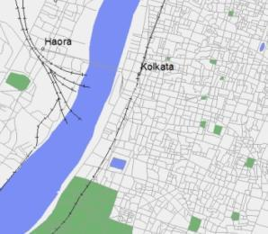
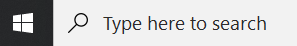
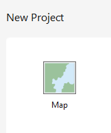
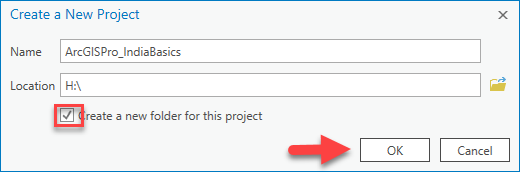
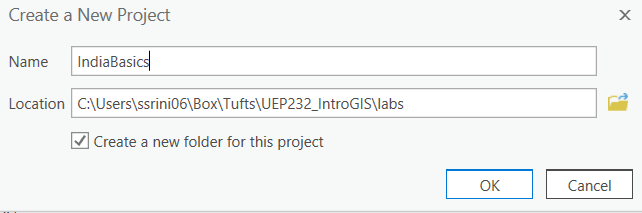
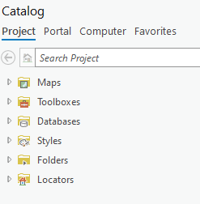
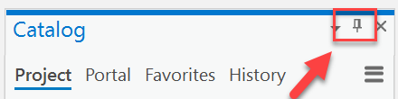
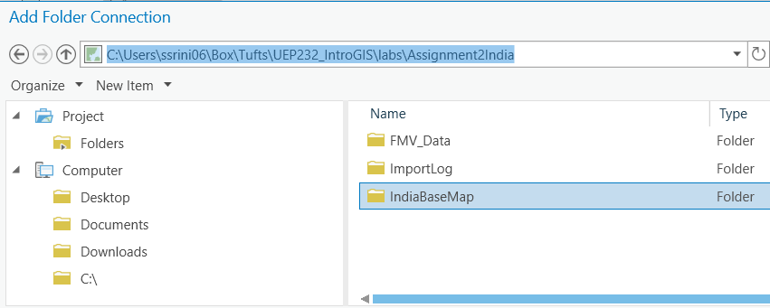
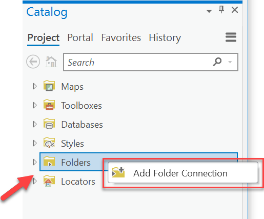
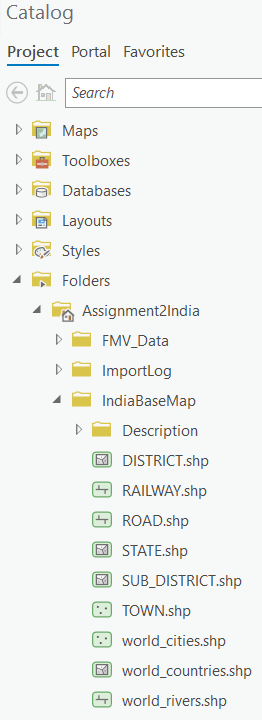

# ArcGIS Basics: India <!-- omit in toc -->
*Creating a map with ArcGIS Pro*

> *Written by Barbara Parmenter, updated by Annie Nguyen on September 9, 2019 for ArcGIS Pro 2.3, updated for ArcGIS Pro 3.1.3 Sumeeta Srinivasan Sep 2023*
> 
---
### Table of Contents <!-- omit in toc -->
- [Introduction](#introduction)
- [Creating a Map with ArcGIS Pro](#creating-a-map-with-arcgis-pro)
  - [Starting ArcGIS Pro and Creating a Project File](#starting-arcgis-pro-and-creating-a-project-file)
  - [Opening Catalog, and adding data layers](#opening-catalog-and-adding-data-layers)
  - [Getting Around the Map Menu](#getting-around-the-map-menu)
---

## Introduction

This tutorial shows you how to use the ArcGIS Pro module to create a simple map. ArcGIS Pro is one of the modules in ArcGIS Desktop. You use ArcGIS Pro to create maps, query data, perform analysis, and most of the other basic GIS operations. ArcGIS Pro is the module that you will use most frequently. This tutorial may take 3-4 hours to complete.

This tutorial is written to be done in the Tisch DataLab or another Tufts campus computer lab.

>**Note for Mugar Lab Users: Mapping a Network Drive in Windows**
>
>*If you are not in the Mugar Lab, skip this section*
>
>If you are in the DataLab, the GIS data server that we need, "M", "H" and "S" are already mapped. To use the DataLab drives from Mugar Lab (or elsewhere), you must first map the network drive in Windows.
>
>1\. Assuming you are using Windows 10, open a file explorer window, on the left side of the screen right click on "This PC" and then select "Map Network Drive."
>
>2\. In the drop-down menu labeled *Drive:* choose the "M" as the drive letter. If the letter "M" is not available, select an available drive letter and remember what you chose.
>
>3\. In the Folder: drop down menu manually enter (or copy and paste):
>
>`rstore1.uit.tufts.edu\\tts_rsch_gis_dataset02\$`
>
> 
> Press Finish.
>
>4\. Mapping other network drives: https://sites.tufts.edu/datalab/accounts-network-drives/

## Creating a Map with ArcGIS Pro

You will now learn the basics of using GIS data to explore an area and create a map. Your efforts will be focused on India.

### Starting ArcGIS Pro and Creating a Project File

1\. ***Download*** the **data** zip file from Canvas or copy the folder from the S: Drive to *your own folder for this exercise*. Extract it in your own folder for this assignment.

2\. To start ArcGIS Pro, type in the Start search bar **ArcGIS Pro** or you can go to Start and then **ArcGIS** → **ArcGIS Pro.**

3\. When the first dialog box comes up, highlight the option to start with a new blank map. Click on the folder in the new dialogue box.

4\. Name your project file. Save the project file to your own folder for this (your H: drive or Box). Leave the box checked to create a new folder for this project and press OK.

|
|:---:
|*Saving to H: drive*

|
|:---:
|*Saving to Box*

5\. You just created a project file: `.aprx`. A project file is a file that contains ***pointers*** to your data sets (it does not actually save the datasets) and remembers what you had displayed in your session. If you quit ArcGIS Pro at this point, you can reopen this project (by double clicking it) and everything will be as you left it; the same data layers will be there and it will have the same view of the data. Thus, project files are easy ways to save work. But **beware** -- **project files do not actually contain data**, they only have **pointers** to where the data is saved. If you copied your *ArcGISPro_IndiaBasics.aprx* file and tried to open it on a different computer without also saving the data layers, the ArcGIS Pro session would start and list the data in the Contents (also sometimes referred to as Table of Contents in previous versions of ArcGIS), but nothing would appear because it would not be able to find the where the data is stored. A little red exclamation point would appear in the Contents, informing you that it has lost the connection to the data.

6\. [![req]][link] Save your project file ***frequently*** and always save at the end of a session. ArcGIS Pro likes to crash!

### Opening Catalog, and adding data layers

1\. Once your project opens, you should be able to see a topographic map on ArcGIS Pro. If not, go to the top menu then, **Insert** → **New Map.**

2\. On the right side, there should be a *Catalog* window. This is like a file manager for GIS data. If this doesn't show up, you can go to the top menu and then click **View** → **Catalog Pane.**

|
|:---:|
|*The Catalog pane*

3\. You can click on the *Auto-Hide* icon (thumbtack) to hide this window (this is helpful when you need to see more of your map). Click on the icon again to keep the window in place.

|
|:---:|
|*Hide and reveal the Catalog pane by clicking the thumbtack icon*

4\. Click to expand **Folders.** You should already have your folder for your project file in here. If not, right-click **Folders** and then select *Add Folder Connection*. This will allow you to access the files for your data.

5\. Click on **Computer** and navigate to the folder where you saved the data for this exercise (extracted from the zip file IndiaBaseMap)**.** For example, you could have saved it to a folder in Box as shown in the screenshots or you could add a connection the data in your H: drive or in the `S:` drive.

|
|
|:---:|
|*Adding a folder connection*

6\. In the Catalog if you **expand** the folder for this exercise, you should see a connection to the data.

|
|:---:|
|*The expanded catalog window*

7\. Click once on each shapefile to highlight it and drag the data layers into the main ArcGIS Pro window. You can also hold **Shift** and click on the first and last file to highlight all drag it into your map. Drag in all the layers with name beginning with `world_` (cities, countries, and rivers)

8\. Uncheck **layers** in the ***Contents*** if you don't want to see them. You can do so by clicking once on the box, located to the left of the file name.

### Getting Around the Map Menu

Make sure the Map menu is active 

1\. Zoom into a part of Africa using the *Zoom In* tool or the scroll wheel on your

mouse.

2. Use the Navigation tools to move around the map.

i. Use **Explore** to pan

ii. Use **Bookmarks** to save where you are on the map to come back to

iii. You can return to a previous extent you were at on the map using these arrows: ) to go back to the full view which encompasses all the data.

**Note**: In ArcGIS, you can place the cursor over each tool in the menu without clicking to see a description of what it does.

9. Select the **Explore** tool and try clicking on countries, rivers, or cities (in the map). This highlights the polygon, line, or point depending on the data and brings up information from the "attribute table" for each feature you click on.

10. Can you find *Gulu, Uganda*?

**Hint**: Choose the *Locate* ( ) tool. You can type in Gulu Uganda in the search bar---there will be several options that come up. Right-click on the first option and select **Zoom To** so that you're brought to Gulu.

4

Tufts Data Lab

Technically all these Gulus are correct---even though its shown as a point on our map, Gulu as a city has an area, and thus is technically a polygon when properly zoomed using Google Maps:

You can see our point for Gulu from the **cities** layer is located near these

points. Click on the point to check that it is indeed Gulu.

11. Right-click on the **rivers** layer in the *Contents* (be sure you right-click

on the actual name and not the symbol) and then click on *Label* -- this

will label the rivers.

12. When you are done looking around, click on the full extent icon in the **Navigation** menu. 

13. Now choose **Project** → **Save Project or Save Project As** on the top menu.

14. Drag in other layers from the IndiaBaseMap folder 

5

Tufts Data Lab

Note that these layers are only for India. Also note that the map will be messy.

15. Zoom into India so that it fills the map. 

16. You can **group** the India data layers all together. If they are no longer all highlighted, hold the CTRL key and click on each one in turn to highlight them. When they are all highlighted, right-click on one of them and choose *Group* as shown below:

17. Rename the "New Group Layer" to India by clicking slow-clicking twice on the label and typing in **India**. 

18. Perform the same grouping on the *World* data layers so that it is in its own group. If you click on the first and last datasets, while holding shift, all layers will get highlighted and you can group them faster.

19. Turn off the *World* data group.

***REMINDER: Save your map project file frequently and always save it at the end of a session!***

**Setting a Coordinate System for the Map Frame**

The rest of this tutorial focuses on India, so we are going to set a coordinate system that better maps India. This will also ensure that any spatial queries you do will perform correctly. We will talk a lot more about projections soon in the course.

1. Right-click on Click on **Map** in **Drawing Order** and choose **Properties.**

6

Tufts Data Lab

2. Click on the **Coordinate System** tab.

3. In the coordinate system dialog box, you will see information in the bottom panel for the current coordinate system (GCS_WGS_1984). 

We want to change this.

4. Scroll down and click on

**Projected Coordinate**

**Systems**, then **UTM** then on

**WGS 1984**, then **Northern**

**Hemisphere**, and finally on

**WGS 1984 UTM Zone 44N**

as shown below and then

**OK**

5. Turn on the world data and

zoom to the full extent ( ).

You will see that this

severely distorts the rest of the world. But it's a great way to map India!

6. Zoom back to India when you're ready and again turn off the world data by unchecking it.

7. To clean up the map, uncheck all the layers except for **the *railway, district,* and *state ***layers within the **[India]{.ul} [Group]{.ul}**.

7

Tufts Data Lab

**Defining the General and Symbology Properties for a Layer**

In this section of the tutorial, you will learn how to organize your data layers\' properties to start bringing some coherence to the map. You will also learn how to color the data layers to start making a more interesting and readable map.

**Assigning Proper Layer Names**

First, you need to give the layers better names than what they have (e.g., *SUB_DISTRICT* → \"Sub-district\").

1. Right click on the *SUB_DISTRICT* layer and choose Properties (alternatively, you can click twice slowly on the data layer name).

2. When you see the **Properties** dialog box, click on the **General** tab and for layer name, type in *Sub-district* instead of *SUB_DISTRICT*. Press OK when finished.

**Note**: this does not change the name of the original data set - it only changes the name as it appears in this *Project Session (.aprx)* of ArcGIS Pro and as it will appear on your final map.

3. Rename all the layers so they are not in all caps. [In the future, points will be deducted on assignments for]{.ul} [having non-standard "data speak" names like \"cntry08\" appearing in your map.]{.ul}

**Assigning Proper Colors**

Your map would be a lot better if the district layer were not blocking the state layer, etc. We want the State boundaries to show up on top of the District boundaries.

1. Right-click on the *State* layer and select **Symbology.**

2. To change the color of the layer, click on the colored box next to Symbol - this should bring up *Symbol Gallery box*.

3. Click on the **Properties** tab. Select **No Color** and make the outline width

2.00. Give the outline a dark gray color. **Note:** You can also access this 

by clicking on the symbol underneath the layer name in **Drawing**

**Order.** 

4. Press Apply when you are finished.

8

Tufts Data Lab

5. Drag the *State* layer to the top of the India group in **Contents**. Now that 

it is hollow you can see the layers underneath.

6. Color the *District* layer beige and give it a 1 pt gray outline width as

shown. Using what you have learned, give appropriate colors to your

other layers.

7. When finished, choose **File** → **Save** again. Now your project file will

remember all the colors and names you assigned. It's starting to look

better...

**Drawing a Layer Based on an Attribute Value**

Some of your layers would look better if you could distinguish between types of features within the same layer. The *State* layer, for example, shows India's state boundaries but doesn't give us more information when drawn with a single color. You can use an **attribute field** to symbolize your data to reflect the **field** values.

1. If it's not already on, turn on the **State** layer (check against it).

2. *Right-click* on the **State** layer and choose *Open Attribute Table*.

3. Before we proceed, you need to know what the items in the attribute tables for the STATE, DISTRICT, and TOWN attribute tables mean. The attribute table contains relevant information about the states, but the field headings (aka column headings) are sometimes hard to understand.

**Metadata** is documentation explaining what is in your attribute table and gives a definition for each of the field headings. To know what attribute fields are appropriate for use in symbolizing your data, you must be familiar with the attribute table structure, its fields, and the possible values of each significant field.

4. In the IndiaBaseMap **WINDOWS folder (the regular folder that you get to through "computer" not in ArcGIS)**, there is a subfolder called DESCRIPTION. Open this folder using your Windows File Manager (**not Catalog**). Look at the STATE.PDF to see what the abbreviations in the attribute table columns mean.

9

Tufts Data Lab

Let's say we wanted to visualize the population of cultivators. We see that the field name for this data item is *TOT_CULT* and that the number of Total Workers is in the field, *TOT_W*.

1. Right click on the State layer and click *Symbology*.

2. Under *Primary Symbology,* select *Graduated Colors*.

10

Tufts Data Lab

3. Change the drop down next to the Field to be *TOT_CULT,* as you see below:

Notice that the options in the Value dropdown are the field headings you saw in the attribute table. 4. If you can't see the data, make sure your "World" group of data is turned off.

5. Now, we see the states with larger numbers of cultivators. What states have the largest numbers? **Hint**: Click on the states to get their information. Make sure you 

are in the mode

But now we want to map the states by showing the ***percentage* of**

**cultivators** out of the ***total number of workers***. To do this, we need to

**normalize** the data by the *Total Workers* field.

6. Go back to ***Symbology***. In the box for *Normalization*, choose the

field, **TOT_W** -- when you use this *Normalize* function, it simply

divides the top value by the normalization value to give you a

fraction, so in this case *Total Cultivators/Total Workers* = % of

Total Cultivators out of the working population.

7. The resulting map shows the number of cultivators in each state

as a fraction of the total workers (e.g., 0.541023 means 54% of

workers are cultivators).

8. Try making the same map (percent of workers who are

cultivators) using the **District** layer instead of **State** layer.

Compare the two layers. You may have to drag one on top of the

other to see them.

How would you create a population density map for the **District** layer (total population divided by area)?

**Note**: The *Tot_Area* column is the *square kilometers* of the district. The State and Sub_district layers do not have a *Tot_Area* column!

11

Tufts Data Lab

9. Try creating other maps based on the attribute table values by State, District, or Sub-District -- the field (column) names in the attribute table are the same for all of these. Save your project file when finished.

**Note:** If you want to keep a layer symbolized one way (e.g., percent cultivators for each state) and also have another map by state (e.g., percent illiterate), you can add the **State** layer again from ArcCatalog and start fresh on the new layer.

10. Assign a proper title to the layers you symbolize. Change the **heading name** (eg. TOT_CULT/TOT_W) to *Percent of Cultivators.* Leave the **layer name** as District. You can change the heading name by clicking twice *slowly* on the heading or by pressing F2 when it is highlighted.

**Selecting and Mapping the Largest Cities in India (optional)**

In this section, we'll use the **Town** layer which includes all of India's towns to select and map only the towns that have a population **greater than 1 million people**.

1. Turn on (checkmark) the **Town** layer. Drag **Town** to the top of the group in the *Contents*. 2. Right-click on the **Town** layer and choose *Open Attribute Table*

12

Tufts Data Lab

.

3. Scroll to the right in the table until you see the TOT_POP field:

4. We're going to use this field to select all the towns in India with 1 million or greater total population. 5. Go to the top menu, click on the **Map** tab and click on **Select by Attributes.**

6. In the query box, make sure *Input Rows* is **Town** and *Selection Type* is **New Selection.** In the query box, use the drop down box to select **TOT_POP** is **Greater than or equal to** and then type in 1000000. Click **OK when done.**

13

Tufts Data Lab

7. You should have 31 towns selected. It should say "31 out of 5161 Selected" at the bottom of the table after highlighting the rows:

8. Close the table. You should see the *over 1 million* towns highlighted in blue on your map.

**Note:** Another way to select these towns is to manually select the total town populations. You can right-click on the **TOT_POP** to select **Sort Descending** and highlight the towns less than 1000 million.

9. To create a layer with just these large towns, right-click on **Town** and the choose *Data* → *Export Features* (as shown in the screenshot)

10. You'll get a new dialogue box like so. Click on the folder next to **Output feature Class** to choose where you will save this layer. Navigate to your folder for this exercise → ArcGISPro_IndiaBasics and within the gdb (geodatabase) that should automatically be created when you open a new project and name the new layer **Large_cities.** Then click **OK.**

Note that you can also save it in the folder as a shapefile Large_cities.shp

14

Tufts Data Lab

11. Once added, change the name from Large_Cities to Large Cities (remove the underscore). 

12. Drag the **Large Cities** layer into the India group so that they are at the top of that group. Turn off the Town layer, so you only see the Large Cities.

13. Click on the *Clear* icon to turn off your original selected towns. This is located in the **Selection** group under the **Map** tab on the top menu bar.

14. To display the large cities with symbols graduated by population size, right click on the layer and select **Symbology.**

15. Fill out the symbology properties as you see below. You want a map showing ***Quantities*** using ***Graduated Symbols***, using the **TOT_POP field** as your value:

16. Turn the full **Town** layer back on.

15

Tufts Data Lab

17. Using the complete **Town** layer, create a graduated symbol map of total 

population using the steps outlined above for **Large Cities**.

You'll see it's quite messy when looking at all of India but provides better

visual information when you zoom into one state. Zoom into a state to see

what we mean. You might need to turn off the **other l**ayers to see the **State**

Layer.

To return to your last "*extent*" or view, press the back button. 

**Note**: If you want to change the colors of the symbols, in the *Symbology*

properties box, above the symbol window, right-click on the layer to go to

**Symbology.** Click on the symbol in **Template** then go to the properties tab.

**Note**: You can also change the number of "*classes*" or break values, by changing the box that says **Classes.**

16

Tufts Data Lab

Click on the back button to return to **primary symbology.** 

You can also change the starting/ending size of the symbols in the boxes

immediately above the symbol window, as shown in the screenshot.

**Save your project file!**

**Selecting Towns by their location relative to Railroads (optional)**

Let's say we wanted to see which towns in India have sufficient access to railroads and which towns do not, and we want to estimate the population in each group. You can use the *Select by Location* function to select features based on their spatial relationship to other layers.

1. Turn on the ***Town*** layer and the **Railway** layer. Pull **Railway** to the top of the India Group in the *Contents.* 2. Click on **Selection** → **Select by Location** on the top menu.

3. Fill out the dialog box as you see below and press OK when finished:

4. You'll see that most towns are within 5 miles of a railroad. How many people live within these selected towns? Let's find out.

17

Tufts Data Lab

5. Right-click on the **Towns** layer and choose *Open Attribute Table.*

6. You will see several records are selected. Scroll to the *Tot_Pop* field and right click on its field name and choose **Statistics** as shown below:

7. When the chart properties pop up you will see descriptive statistics for the selected features, including a "sum" value of about 245 million people on the side panel. That's our answer! But how many people don't live in a town within 5 miles of a railroad?

8. Close the *Statistics* box. Click on the Switch Selection Icon at the top of the [attribute table]{.ul}, as shown below: 

9. All the towns that were not selected before are now selected --

these are towns that are **greater than** 5 miles from a railroad. Right

click on the *Tot_Pop* column to get the *statistics* for this group --

you should see the sum is around 40 million people.

You see that the Statistics function gives you descriptive statistics for the

**selected features**. If no features are selected, it gives you descriptive

statistics for the **entire set of features**. You can click on the **selection** again

in **Filter** to deselect . Or you go back to the table or

the table tab, and you can *clear the selection* of **Town** ( ).

10. Close the statistics, clear your selection , and close the

attribute table.

18

Tufts Data Lab

**Labeling a Layer Based on an Attribute Field**

You can label features based on attribute values. Let's label the States.

1. Right-click on the **State** Layer and choose *Label*. It should automatically 

populate with the appropriate state names. If it doesn't, right-click again on

**State** and select **Labelling Properties.** If the *Expression* box doesn't say

**\$feature.NAME,** erase whatever's in the box. Find *Name* in **Field** and

double-click it to populate the *Expression* box. Click Apply.

2. Note that the names for some states are repeated -- that's because the

state may have islands or other non-contiguous sections that are

represented twice in the database, and so get double names. To get rid of

the double names, right-click on the **State** layer and click on *labelling*

*properties*.

3. Click on *Position* then then select **Remove all duplicate** from the drop

down for Duplicate labels

**Changing the Formatting of Labels**

Let's say you want to have the **State** names stand out more on the map. We can do this by changing the label's format.

*1.* If you aren't already in **Labelling Properties** right-click on state and select the option. Go to **Symbol** tab and then to *Appearance.*

19

Tufts Data Lab

2. You can choose the font, size and color of your labels here -- try making them *bold, Calibri, and 10pt f*ont (for example) and click on Apply

3. If you don't like the results, adjust the label format again as you wish. Check out some of the predefined label styles.

**Using Data from ArcGIS Online (optional)**

ESRI and other agencies are hosting online GIS data servers that you can access from ArcGIS Pro. We're going to use one of these streaming layers now. Make sure you are signed in and don't see the not signed in . The ArcGIS organization name is tuftsgis.

1. We're going to change our base map. In the **Catalog** panel, Go to **Portal** and then click on **Living Atlas** 

2. Move the **World Imagery** layer to the bottom of your *Contents*.

3. Remove your original Basemap at the bottom of the *Contents*. To remove a data set you don't want, right click on the data layer main name (e.g., *Basemap*) and choose *Remove*.

4. If you don't remove it, turn off the layer for now. It makes drawing very slow. You can choose this base map or keep the original World Topographic Map, it depends on you.

**Measuring Distance and Area and Drawing a Map to Scale**

**Measuring distances and areas** 

1. Click on the **Measure** tool in the Main toolbar under **Map**.

2. Click somewhere on the map to start a measuring line. Drag the line 

somewhere else and click again. You will see two measurements

reported in the Measurement window. The first, *segment*, gives the

distance of the line you just drew. The second, *Path*, gives the total

distance. Click on a third point in the map and make another line

segment. Every new line you create, the tool sections off *segment* and

*path* for each of your different lines. *Sum* gives the total distance of all

your different lines. Double-click on the map to stop measuring.

**Note**: If you want to measure in a different unit, select a new distance unit

20

Tufts Data Lab

**Drawing a map at a set scale**

Many professional map users expect printed maps to be at a standardized scale. USGS topographic maps are printed at 1:100,000 scale (1 inch on the map equals 100,000 inches in the real world or about 1.58 miles) and at 1:24,000 scale for example (1 inch on the map equals 24,000 inches in the real world, or 2000 feet or about 0.38 miles). In ArcGIS you can scale your map to any scale, but you are also offered standard scales from which to choose.

1. Set the scale of your map to 1:10,000. The scale is located on the bottom left of the map next to the Catalog. 

This is very "large scale" map (lots of detail, small area displayed) so it would work well for a map of a city but not for a map of a state or the entire country.

2. Experiment with some of the other map scales. Which scale would be good for a map for the entire country or one state? You can also type in a scale yourself (you only have to type the denominator, e.g, 24,000, with or without commas).

These are unitless scales. 1:24,000 means that one unit on the map (or your computer screen) equals 24,000 of those same units in the real world. The scales provided are standard paper map scales in the United States. 1:24,000 is the map scale of the USGS topographic quadrangle maps (sometimes known as 7.5 minute maps because they cover 7.5 minutes of latitude and longitude).

3. Try typing in 150,000 in the scale box -- this creates a map at 1:150,000 scale (1 inch on the map equals 150,000 inches in the real world).

21

Tufts Data Lab

**Creating a Layout for Printing or Graphic Export**

To create a printable map, you will use the layout view. It is a paper view of your data, much like viewing the page layout when you are working in a word processing software. You should use the **layout view** when you are ready to create a map -- do all the preliminary work and analysis in the **data view** (where you have been up to now in this tutorial).

In this tutorial, you can create a map of all or any part of **India** you like

When you create a map, you could include:

• **The map itself**

• **A descriptive title**

• **A legend**

• **A scale bar (in kilometers for international data)**

• **A north arrow**

• **Name of the cartographer (you)**

• **The Date & Class**

• **Acknowledgements of data sources**.

It is important not to include too much information in a map layout. You would not want a map that includes all the data layers you have in your ArcGIS Pro session from this tutorial. It would be much better to do several separate layout maps.

You may also include other elements on your map -- for example, more explanatory text, labels, charts, tables, photos, or other images.

Note that you can also have more than one map frame on a layout -- for example, you can have a small locational reference map or an inset map to show an area in more detail or situate your detailed map in a larger context. See the next section (*Adding a map frame to show two or more maps on a layout*) for instructions about how to do this.

For detailed information about layouts, go to online to ArcGIS Pro Layout: 

[https://pro.arcgis.com/en/pro-app/help/layouts/layouts-in-arcgis-pro.htm]{.ul}

**Setting up a Map Layout**

1. Before you start a map layout, it is important to think through what you want to

do and how you want your map to look. What do you want to show? How large

do you want your final map to be? Portrait or landscape orientation? Do you need

space for additional text or graphics? This tutorial example will assume a printer

paper size (8x11 inch) map but often you are making map for publications where

they must be smaller, or for Powerpoint where they need to be a certain size

(e.g., 7.5x10 inches), or for posters where they may be much larger than 8x11.

2. In the Main Menu Bar, choose **Insert** → **New Layout** and choose Letter 8"x11.5"

either *Landscape* or *Portrait* (which would be better for the map you want to

create? The example map is in *Portrait* orientation).

22

Tufts Data Lab

3. The view changes to show your map frame on a page layout and a new toolbar appears -- the *Layout* toolbar. 4. Go to the main menu bar **Insert** → **Map Frame** and select the symbolized map

5. **Then draw a box onto** the layout, and fit as much as possible onto the

layout. The map you selected will draw within the extent that you drew in

the layout

**Moving Around in the Page and Map Frame**

1. It is very important to understand the difference between the **Layout**

and the **Map**. To be able to move around in your *Map (not*

*Layout)***,** click on your map **. This will change the**

**menu** so you can zoom in and out of your map using the scrolling wheel or

**Explore** tool in Map and click to pan around.

**Resizing and Moving the Map Frame**

You will always need to re-size things in your map, especially the map frame itself which contains the map image. In this case we are moving and resizing our map frame so that it fills the 4/5ths of our page (as shown below). We'll then put a title, legend, and other map requirements in the blank space along the bottom of the page:

Moving and re-sizing in ArcGIS Pro works similarly to most other programs where you use graphics. The key is selecting the element first. The steps for this are on the next page.

1. To resize and move the map frame, use the **Select** pointer under the **Layout** view to select the frame. 

2. Use the small grab points on the corners and sides to resize.

3. Click and drag with the cursor anywhere over the map frame to move it.

23

Tufts Data Lab

**Inserting a Title, North Arrow, Scale Bar and Legend**

This is the Map Frame.

This is the Paper Outline

These are all required elements on all maps. You access them by going to the **Insert** item on the *main menu* bar.

You can read more about these by going to [https://pro.arcgis.com/en/pro-app/help/layouts/layouts-in-arcgis-pro.htm]{.ul} and then scrolling down to **Related Topics** about adding elements to your map.

24

Tufts Data Lab

1. Use the ***Insert*** menu function to insert **a North Arrow**. Draw a space for it in the layout. Place it in the bottom, empty part of your map layout initially. 

**Insert Scale Bar**

2. Insert a scale bar of your choice. You may wish to change the units of the scale bar you select. If you want a different unit, double-click on the scale bar. A new window shows

up**.** In the *Map Units* section, select a different *Division Unit (Kilometers for International*

*Data!)*. You can size the scale bar using the corner nodes. Make sure it ends on an even

and easy to read number (eg. 4 Km instead of 4.5 Km).

**Insert Legend**

There are lots of ways to improve your legend. For starters, let's say we're creating a map of Larger Cities in India. We want the legend and map to focus on large cities. To control what goes on the legend:

1. Choose **Insert** → **Legend** from the main menu and click and draw on the layout to create small box for the legend.

2. Adjust what is in the legend so that only **Large Cities** is there by following the graphic below. Click on the legend so that the **Format Legend** panel shows up on the right.

3. In the **Contents/ Drawing Order** for your map layers, unselect every layer except **Large Cities.**

25

Tufts Data Lab

**Note**: make sure **Large Cities** is checked in the *Contents* in your **Map**, or else the 

legend will be blank.

*4.* Go back to your **Layout view**, click on your legend again to access its properties. For **Title,** type in **Cities Population.**

5. You can change its properties (font, size, etc) by clicking on **Text Symbol** → **Font in (Appearance)** 

6. There are lots of things you can edit in the **Show Properties**. Explore the different tabs to see all the options. 

26

Tufts Data Lab

**Selecting Elements**

You can select more than one element by holding down the Shift key as you click on each element.

**Modifying an element after insertion**

You can usually modify an element after you have inserted it by selecting it and then double-clicking on it. The relevant dialog box will appear for that element (e.g. legend, scale bar).

**Inserting text**

7. To include the title, your name as the cartographer, and any other information, use the **Insert** tab on the Main menu and select the style of text for a title. Remember also to include text for date. You should also have a data source - note that the data comes from the Tufts GIS M Drive (For later tutorials, it will need to be more specific). 

8. Add more text for any more descriptions or explanation of your map. 

9. You can change font properties on selected text by right-clicking on

the selected text and choosing **Properties and** then changing the **font**

**name** in **Text Symbol**

**Inserting a Picture**

Note that you can also insert images into the map frame using the **Insert** tab

and then going to the Graphics group.

**Deleting and Trying Again**

If modifying an existing element doesn\'t work, remember that you can always select an item and delete it if you don\'t like it. You can right-click on it and press *delete*. Especially useful if your legend gets messed up - just delete and insert a new legend again to start fresh.

**Adding a Second Map Frame to Show an Inset Map**

You can add a second (or more) map frame to your ArcGIS Pro session. This can be handy for putting in a small \"locator\" map.

**Adding a Second Map Frame for a Locator Map**

In this example, we'll use a new map frame to insert a locator map.

27

Tufts Data Lab

1. In *Layout View*, choose **Insert** → **New Map** from the top main menu. A new map will appear on the top tab. Click on this new tab and rename the map frame to **Inset Map** by clicking on the Frame in **Drawing Order** twice slowly**.**

2. Go back to your layout view and click on **Insert.** Insert another map frame in your lay out---click on the current extent for your new inset map.

3. Move and resize the *new map frame* box so it is

in the location you want it -- here we are taking

it to the bottom right corner of our layout.

4. You can add data to this map just as you did to

the first one. In the *Contents*, you can drag a

layer from the Catalog. You can also copy from

another Map frame: right click on the *Countries*

layer from the original frame (**Map Frame)** and

select *copy.* Right-click on the second map

frame (**Inset Map**) and click paste. Make sure to

turn on the new layer so it is visible.

28

Tufts Data Lab

5. Also drag the **State** layer (in your India group layer) in the Inset map frame.

6. Zoom closer to India in the map frame. 

7. Make sure to drag the state boundaries above the Countries. Countries

should be white with a gray outline.

8. Set the **State** fill color of your choice but with no outline so you will

highlight India boundaries and not the state boundaries.

9. Get rid of the distracting service layer text by clicking on **Insert** on the

main menu then **Dynamic Text** **.** Scroll down to the **Layout**

section and select **Service Layer Credits.** Draw a box anywhere on the

layout so that the service layer credits become its own text box. Drag the text box over to the edge of the layout. 

When you export your layout, the service layer credits will not show up in your final exported map. **Setting up Locator Map Boundary Box (optional)**

Finally, we're going to show a boundary box on our *Locator or Inset Map*.

1. Select your inset map using the select tool ( 

29

Tufts Data Lab

3. If you want to change the size and color of your extent indicator, in the *Contents/Drawing Order,* right-click on the **extent indicator** layer underneath **Map Frame 2** and select **Properties.**

4. In the new panel, make sure the source is set to the original Map Frame (just known as "Map Frame" here)**.** Click on the boxed symbol, and go to **Properties** to change the size and color.

**Printing or Exporting your Map**

You can print directly from ArcGIS Pro or you can export to a digital graphic format like .pdf. Printing works just like any other Windows program, so we won't cover that here, but feel free to print your map.

The ability to **export** to a digital format is very useful. If exporting to an image, remember to set your page size to the appropriate dimensions - this may mean custom dimensions, e.g., a small image to fit on a computer screen, a powerpoint presentation, a web site, or word document. When creating a layout for digital export, you should think ahead about what size you want your final image and lay out the map accordingly and be sure to use font sizes that are readable at the final map size.

1. When you have your layout the way you want it, choose **Share** → **Layout Export.**

2. In the *Export* dialog box that appears, navigate to your tutorial folder and give the image a name.

3. For *Save as Type*, choose a format - we recommend **.gif or .png or .pdf** because they come out well and are readable across a variety of platforms. The only problem with PDF formats is that they do not import well into Microsoft publisher and they do not recognize all text fonts.

30

Tufts Data Lab

4. **Before you export,** adjust the **Resolution (DPI)** to at least 300. Digital images meant to be seen on a computer screen do not need high resolution. 96 or 150 should be fine depending on image size, 300 should be the maximum.

5. Press **Export** when you are ready to go - the process will take a minute.

**Note:** You must be in layout view to export your layout. If you're in map view, you'll just export your map instead.

6. Check your results by navigating to the folder outside of ArcGIS and opening the graphic - if you're not pleased, experiment with different resolutions and compare file sizes.

That\'s the basics. Now practice what you have learned by creating several maps of India, a region within India or a State

31

Tufts Data Lab

32

<!-------------------------------------[ Links ]
---------------------------------------->

[link]: #

<!---------------------------------[ Buttons ]--------------------------------->

[req]: https://img.shields.io/badge/IMPORTANT!-red?style=plastic