

# **Mapping ancient places** <!-- omit in toc -->
*Use a gazetteer of the ancient world to make sense of XY data and coordinate systems*

| 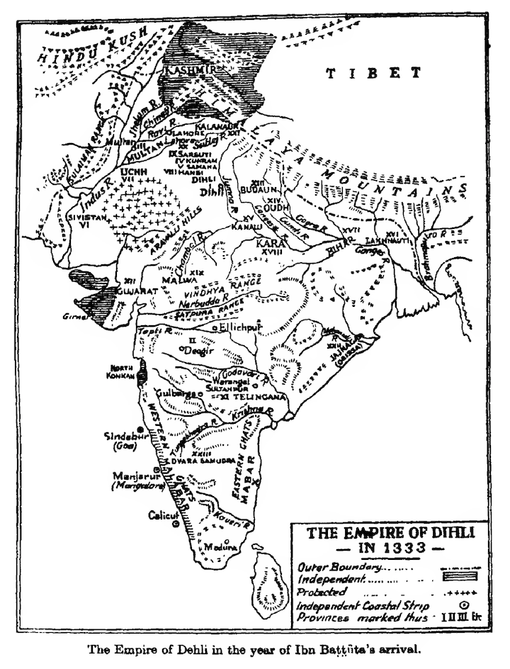 |
| :-: |
| *The Empire of Dehli in the year of Ibn Battuta's arrival, from* [The Rehla of Ibn Battuta (India, Maldive Islands, and Ceylon)](https://ia902205.us.archive.org/33/items/TheRehlaOfIbnBattuta/231448482-The-Rehla-of-Ibn-Battuta_text.pdf) *(1976)*. |
| |

# Table of contents <!-- omit in toc -->

- [**Introduction \& context**](#introduction--context)
- [**Setting up your workspace**](#setting-up-your-workspace)
- [**The data**](#the-data)
  - [**Download it**](#download-it)
  - [**Check things out in Microsoft Excel**](#check-things-out-in-microsoft-excel)
- [**Loading XY data to ArcGIS Pro**](#loading-xy-data-to-arcgis-pro)
  - [**🌎 Geodesy in 5 minutes**](#-geodesy-in-5-minutes)
  - [**Coordinates**](#coordinates)
  - [**Coordinate systems**](#coordinate-systems)
    - [**Geographic coordinate systems**](#geographic-coordinate-systems)
    - [**Projected coordinate systems**](#projected-coordinate-systems)
    - [**Managing coordinate systems in ArcGIS Pro**](#managing-coordinate-systems-in-arcgis-pro)
  - [**Loading tabular data as points in ArcGIS Pro**](#loading-tabular-data-as-points-in-arcgis-pro)
  - [**Querying Pleiades data to find simple patterns**](#querying-pleiades-data-to-find-simple-patterns)
    - [**Doing that**](#doing-that)
    - [**Doing more of that**](#doing-more-of-that)

# **Introduction & context**

<!-- ## **The traveler**

Ibn Battuta was a traveler. He began his travels as part of a [Hajj](https://en.wikipedia.org/wiki/Hajj), but over a period of nearly thirty years between 1325 and 1354, Battuta covered about 75,000 miles. He visited the equivalent of 44 modern countries which were then mostly under the governments of Muslim leaders of the World of Islam, or "Dar al-Islam" (n.d., Berkeley ORIAS' [*The Travels of Ibn Battuta*](https://orias.berkeley.edu/resources-teachers/travels-ibn-battuta)).

According to Marlène Barsoum (2006:195), Ibn Battuta "travelled by horse, mule, camel, ox-wagon, raft and on foot, spanning about three times the distance Marco Polo, the other illustrious medieval traveller, claimed to have crossed." At the conclusion of his travels, he dictated the details of his *Rihla*, which translates both to "journey" and "journal," to Ibn Juzayy. This dictation, in a number of languages, survives today.

In modern terms, he traveled to through North Africa, Palestine, Syria, Baghdad, Iran, Yemen, East Africa, Oman, the Persian Gulf, Asia Minor, the Caucasus, southern Russia, India, the Maldive Islands, China, Andalusia, and the Sahara. However, you can imagine that scholars of this period of Islamic Middle Eastern history may want to plot these places on a map. If we can do that using era-appropriate place names, even better.

Let's take a crack at it. -->

<!-- ## **Deadlines & logistics** -->

Using the [Pleiades dataset](https://pleiades.stoa.org) – a [gazetteer](https://en.wikipedia.org/wiki/Gazetteer) of ancient place names – you'll plot the first chapter of his *Rihla* on a map.

This activity will primarily focus on:
* formatting tabular data for GIS in Microsoft Excel
* displaying XY data
* basic attribute table queries
* troubleshooting geographic and projected coordinate systems
* basic table joins

By class time on January 30, you should have submitted a couple of screenshots from this activity to Canvas in `.docx` format (this counts towards participation).

# **Setting up your workspace**

Set up a workspace for this exercise by using Windows File Explorer  to create a directory structure where you'll keep all your files.

Again, there are three places where you can save your work: your **H: Drive**, your **Box account**, or a **personal thumb drive**.

As discussed in class, we recommend using the **H: Drive**, but of course you can choose whichever you want. In any case, your directory structure should resemble the following:

    week02/
    ├─ activity_mapping-ancient-world/
        ├─ data/
        ├─ workspace/
        ├─ submission/

The `data` folder will contain all the data you need to download for this exercise. The `workspace` folder is where you'll store your ArcGIS Pro project file, as well as the [geodatabase](https://pro.arcgis.com/en/pro-app/latest/help/data/geodatabases/overview/what-is-a-geodatabase-.htm) associated with it. Finally, the `map` folder is just for exporting drafts of the final project.

# **The data**

## **Download it**

Head over to [Pleiades](https://pleiades.stoa.org/) (https://pleiades.stoa.org/) and click the **Downloads** tab in the upper-right hand corner. Click the link under "Pleiades data for GIS (CSV)" and click the link on the next screen at "Download latest dataset."

Like datasets you've seen before, this one hits your `Downloads` folder as a `.zip` file. Go ahead and extract the contents with `Right-click` ➡️ `Extract all` ➡️ `Extract`. Click through the "unzipped" folders until you get to the data itself.

You'll notice that many of our source data files suffixed with `.csv`. That's short for "comma separated values," which means it's a text file containing rows (e.g., observations) and columns (e.g., variables). The rows are separated by [carriage returns](https://en.wikipedia.org/wiki/Carriage_return) and the columns are separated by – you guessed it – commas.

Although there's tons of interesting stuff in this folder, we're only going to be using the `places.csv` file today. Go ahead and move that file into your `data` folder. You can open it in an application like, which can easily parse `csv` files...

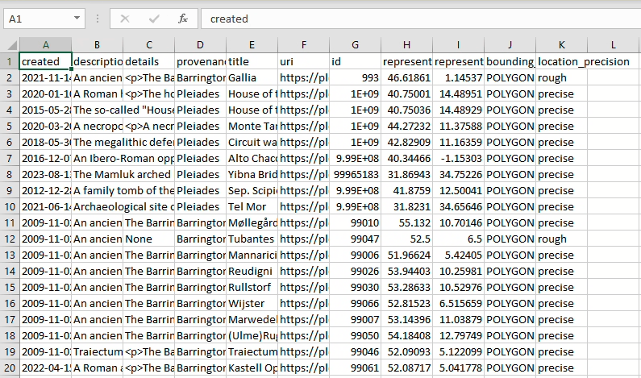

... but if you were to look at the underlying data in a [text editing application](https://en.wikipedia.org/wiki/Text_editor) like [Notepad](https://notepad-plus-plus.org/) or [Visual Studio Code](https://code.visualstudio.com/), you'd see something a little less human-readable:

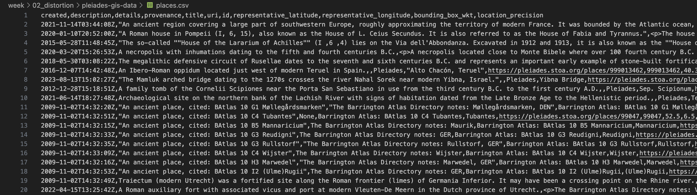

Now, open up ArcGIS Pro and create a new project file. **Remember, change the location from the C: drive to your H: drive (or wherever it is you're saving your project).** Save the project inside your `workspace` folder. You can leave "Create a new project folder" unchecked if you want – the ArcGIS Pro project files are the only thing you'll save inside it.

When you're done, your directory structure should resemble:

    week02/
    ├─ activity_mapping-ancient-world/
        ├─ data/
            ├─ places.csv
        ├─ workspace/
            ├─ multiple
            ├─ ArcGIS
            ├─ Pro
            ├─ folders
            ├─ and
            ├─ files
        ├─ submission/

## **Check things out in Microsoft Excel**

Any time you're trying to load a table into ArcGIS Pro, you want to have a quick look through its contents.

Open the `places.csv` file in Microsoft Excel by `double-clicking` the file. There are two really important fields in here that will allow us to do that: `representative_latitude` and `representative_longitude`. 

Thankfully, the dataset is really tidy, so we don't need to fuss with it a lot. However, it's best practice, when possible, to keep your field names to 10 characters or less. This specification is important because the **shapefile** format has a field name maximum character limit of 10, and shapefiles are encountered really commonly in GIS and geospatial humanities workflows.

Rename each field name so that it contains 10 characters or less. (The destination format of this file is an [ArcGIS feature class](https://pro.arcgis.com/en/pro-app/latest/help/data/geodatabases/overview/feature-class-basics.htm), so it's not *super* important in this case, but again: this is best practice.) The result should resemble:

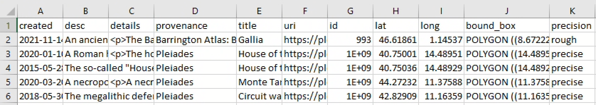

# **Loading XY data to ArcGIS Pro**

Let's turn that `csv` file – an example of *tabular* data – into real-life, bona fide *spatial* data. When we're done, we'll have a feature class of vector points that displays over 40,000 ancient place names. The best part: it's super easy...

## **🌎 Geodesy in 5 minutes**

... but first, we should take a moment to wrap our heads around the round globe.

[Geodesy](https://support.esri.com/en-us/gis-dictionary/geodesy) is the study of the shape and size of the earth, including its gravitational and magnetic field. It's a pretty complicated science – made all the more so by the fact that the Earth is not *truly* a sphere, but in fact a [lumpy oblate spher*oid*](https://www.esa.int/ESA_Multimedia/Images/2010/04/Earth_Explorers_The_Earth_s_true_shape) – so here's a quick and dirty highlight reel of geodesy for geospatial humanists like yourself.

## **Coordinates**

We measure locations on the earth's surface in **coordinates**, most often described in terms of their position on an X-axis (horizontal) and Y-axis (vertical). You'll probably encounter XY data most commonly as latitudes and longitudes like the ones in the `places.csv` spreadsheet, but they can also be represented in **DMS**, or "degrees-minutes-seconds" format: `0° 0' 0"`, followed by a cardinal direction `N`, `S`, `E`, or `W`.

Sometimes you'll need to convert from one to the other. If you're ambitious, you can make those conversions [by hand](https://manoa.hawaii.edu/exploringourfluidearth/physical/world-ocean/locating-points-globe/compare-contrast-connect-converting-decimal-degrees), but in these cases I prefer to use an [online lat-long converter](https://www.latlong.net/lat-long-dms.html). Converted from lat-long to DMS, the first record in our `places.csv` would be `46° 37' 6.96" N, 1° 8' 43.08" E`.

## **Coordinate systems**

We're speaking in terms of coordinates because when flattened out, the world essentially becomes a big coordinate **grid**.

On the X-axis, lines of **latitude** (also known as *parallels*) wrap horizontally around the earth. The **equator** is the largest parallel at `0°`, but they become smaller as they approach +/- `90°` at either of the poles. 

On the Y-axis, lines of **longitude** (also known as *meridians*) wrap vertically around the earth, intersecting one another at the north and south poles. The **Greenwich Meridian** that passes through the Royal Observatory in Greenwich, England is arbitrarily designated at `0°`, a decision that Giordano Nanni has described as "[the colonization of time](https://colonialfamilies.wordpress.com/2014/03/30/review-the-colonisation-of-time-by-giordano-nanni/)."

> **NOTE:** I will be the first to admit that I still need to use a dumb little thing to remember the difference between latitude and longitude. **Remember: *lat*-itude is *flat*-itude.** Dumb little things are good; dumb little things are okay.

|                                                     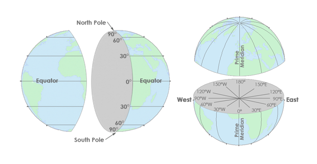 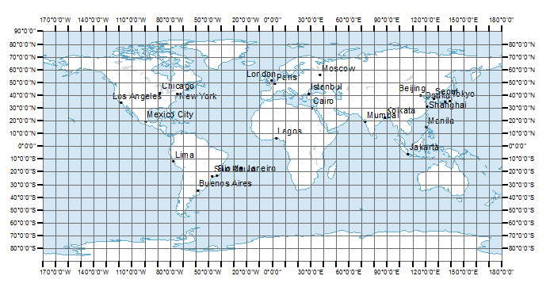                                                     |
| :-------------------------------------------------------------------------------------------------------------------------------------------------------------------------------: |
| *Lines of latitude (left) and longitude (right), which form a graticular network (bottom), courtesy of [GISGeography](https://gisgeography.com/latitude-longitude-coordinates/).* |
|                                                                                                                                                                                   |

The X and Y axes meet at the grid's **origin**, and all other locations on the grid are specified relative to that origin. This is an example of a **Cartesian coordinate system**, or a grid formed by [juxtaposing two horizontal and vertical measurement scales](https://www.e-education.psu.edu/natureofgeoinfo/c2_p10.html).

You'll most commonly encounter two kinds of coordinate systems when working with geospatial data: **geographic coordinate systems** and **projected coordinate systems**. They're closely related, but distinguishing them is really important.

### **Geographic coordinate systems**

|                                  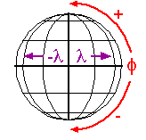                                  |
| :-------------------------------------------------------------------------------------------: |
| [*Geographic coordinate system*](https://www.e-education.psu.edu/natureofgeoinfo/c2_p10.html) |
|                                                                                               |

A **geographic coordinate systems (GCS)** defines positions on the surface of the earth. It uses concrete, measured values to define global parameters, in the literal sense of the word "global." An example is `WGS84`. Its global parameters are [defined as follows](https://www.unoosa.org/pdf/icg/2012/template/WGS_84.pdf):

| **Parameter notation value**                                            | **Notation** | **Value**                                                          |
| :---------------------------------------------------------------------- | ------------ | ------------------------------------------------------------------ |
| Semi-major Axis                                                         | a            | 6378137.0 meters                                                   |
| Flattening factor of the Earth                                          | 1/f          | 298.257223563                                                      |
| Nominal Mean Angular Velocity of the Earth                              | ω            | 7292115 x 10-11 radians/second                          |
| Geocentric gravitational constant (Mass of Earth's atmosphere included) | GM           | 3.986004418 x 1014 meter3/second2 |
|                                                                         |              |                                                                    |

### **Projected coordinate systems**

| 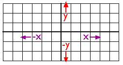                                                                |
| :----------------------------------------------------------------------------------------- |
| [*Projected coordinate system*](https://www.e-education.psu.edu/natureofgeoinfo/c2_p10.html) |
|                                                                                            |

A **projected coordinate system (PCS)** defines how to display that lumpy, oblate, spheroid surface as a flat map. It uses abstract, mathematical formulas to effect cartographic transformations that show certain areas on the globe with less distortion, and other areas with more. An example PCS is `Mercator`. Its [formula](https://www.marksmath.org/classes/common/MapProjection.pdf) is:

$$ T(ϕ, θ) = (θ, ln(|sec(ϕ) + tan(ϕ)|)) $$

### **Managing coordinate systems in ArcGIS Pro**

I'm only throwing this fancy math at you to highlight the distinctions between the two kinds of coordinate systems – *not* because you need to know it in order to do geospatial humanistic work. Here's a table highlighting differences:

|                                | **It represents...**                | **It uses...**                  | **Examples include...**     |
| ------------------------------ | --------------------------- | ---------------------------- | ---------------- |
| *Geographic coordinate system* | Globe (e.g., the territory) | Degree units (e.g., 40° W)   | `WGS84`, `NAD27`     |
| *Projected coordinate system*  | Places (e.g., the map)      | Linear units  (e.g., meters) | Mercator, Peters |
|                                |                             |                              |                  |

To view spatial data in ArcGIS Pro, you don't need to use a PCS, but you *must* use a GCS. When a geographic coordinate system is selected without a PCS, your map will be projected using the [pseudo-plate carrée projection](https://support.esri.com/en-us/gis-dictionary/display-projection).

You can view project-wide information about GCS and PCS by `right-clicking` the "Map" layer in your **Contents** pane ➡️ `Properties` ➡️ `Coordinate Systems`.

You can view layer-specific information about GCS and PCS by `right-clicking` an individual layer ➡️ `Properties` ➡️ `Source` ➡️ "Spatial reference."

## **Loading tabular data as points in ArcGIS Pro**

Under the **Map** tab in the banner, select `Add Data` ➡️ `XY Point Data`. This will open the **XY Table to Point** geoprocessing tool. (There are always multiple ways to do a thing in ArcGIS Pro; note that you could also access this tool by searching for it in the geoprocessing toolbox.)

In your tool, set the parameters to:

* Input Table = click the folder icon, navigate to where you saved `places.csv`, and select that file
* Output Feature Class = save the file as `pleiades_places` in your project geodatabase
* X Field = `lat`, or whatever you named the **latitude** column
* Y Field = `long`, or whatever you named the **longitude** column
* Z Field = this can stay empty (it refers to height)
* Coordinate system = You should always check the metadata to see what the data's source projection is. In our case, the right answer is in the [Pleiades metadata](https://atlantides.org/downloads/pleiades/gis/). Refer to that.

Click `Run` and you should see this:

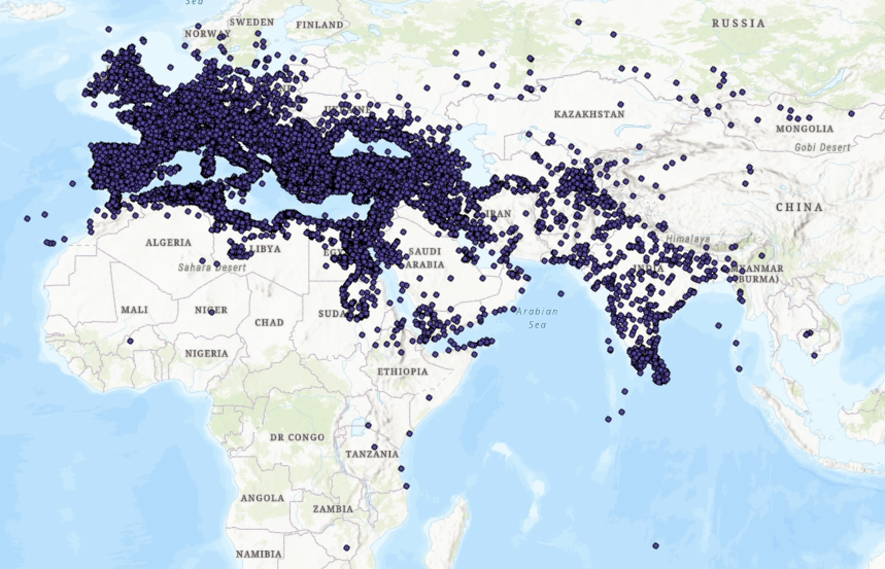

Nice!

Now we've got a full-fledged feature class containing 40,000 points of ancient places, plotted from a humble `csv`. That said, it's kind of difficult to make sense of all this...

## **Querying Pleiades data to find simple patterns**

... so let's see if we can break this data down and find any interesting patterns.

First, go ahead and open the attribute table. You can refer to the [Pleiades metadata](https://atlantides.org/downloads/pleiades/gis/) if you're confused by any of the fields (although note that the field nammes won't be exactly the same if you edited them before loading the data).

While the `title` field has the most obviously *mappable* information, the description `desc` field has got lots of fascinating information:
* "A necropolis with inhumations dating to the fifth and fourth centuries B.C." (Monte Tamburino necropolis, `OBJECTID: 4`)
* "A nuragic complex consisting of a 'megaron-type' temple and a giant's grave." (Sa Carcaredda, `OBJECTID: 248` )
* "A major settlement mound along the Orontes river in Syria with over 10,000 years of occupational history from the Pre-Pottery Neolithic to the Mamluk period." (Tell Qarqur, `OBJECTID: 192`)

What if we were able to search through the entire contents of this feature class for interesting words like "mound" and "grave" and "necropolis," selecting only those features which include such terms?

Wait a minute! We *can* do that!!!

### **Doing that**

1. At the top of the attribute table, click the **Select by Attributes** button. It will open a little dialog box.
2. You can leave the Input Rows and Selection Type parameters as they are.
3. Click the 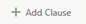 button in the middle of the dialog and then set the parameters of your new clause like so...

    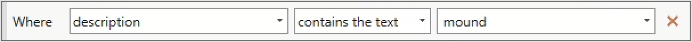

4. ... and click `Apply`. You should see a message pop up notifying you that "The input has a selection. Records to be processed: 148."
5. This message just means that if you were to run a **geoprocessing tool**, it would only apply to selected records. Also, all your selected records appear on the map in a light blue color. Neat! Click `OK`.
6. At the bottom-left hand side of the attribute table, toggle the view from "all records" to "selected records."

    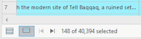

    Now the attribute table should show you only those records you selected.

7. `Right-click` on the "pleiades_places" layer in your **Contents** pane and choose "Zoom to layer." This is a really handy shortcut for snapping the data to full screen in your map view.
8. Just eyeballing it, do you notice any patterns in how the blue points are distributed?

### **Doing more of that**

Take a moment to do more of that. Test out a couple of other keywords in your query. Replace "mound" if you want. Once you've found a few that you like, combine them with the "Add Clause" button in the **Select by Attributes** interface. **You should choose at least 3 queries in total**. Be conscious of how you're using [boolean operators](https://researchguides.library.tufts.edu/hsl-advanced-searching).

While you're at it, toggle the SQL button 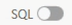 on and off to see how your queries are actually being composed behind the scenes. Eventually, you'll probably find it just as easy – if not easier – to type these kinds of queries out manually than to select them using an interface.

Note that if your attribute table is set to only "Show Selected Records," you won't see the Select by Attributes tool.

> [![q]][l] [Take a screenshot](https://support.microsoft.com/en-us/windows/use-snipping-tool-to-capture-screenshots-00246869-1843-655f-f220-97299b865f6b) of the ArcGIS Pro screen showing the three queries that you decided to run and paste it in a Word document to be submitted at the end of the activity (it should include the total number of features).
> 
> Below it, describe in 2-3 sentences the geographical distribution of the selected points (e.g., where they are clustered).

<!-- # **Using Pleiades data to map Ibn Battuta's travels**

Now that you've got a handle on the data itself, let's turn our attention back to the traveler Ibn Battuta.

His *Travels* are available to read online for free in a [variety](https://www.defence.lk/upload/ebooks/The%20Travels%20of%20Ibn%20Battuta.pdf) of [locations](https://upload.wikimedia.org/wikipedia/commons/b/bd/The_Travels_of_Ibn_Bat%C5%ABta.pdf), but the one from [Carnegie Mellon University](https://web2.qatar.cmu.edu/~breilly2/odyssey/Ibn%20Batuta.pdf) is the easiest.

These instructions will show you how to filter ancient places that appear in the first Chapter of Ibn Battuta's journey, using ArcGIS Pro and Microsoft Excel.

1. Read through the first Chapter of the *Travels* (it's only a few paragraphs long) and mark all the place names you can find in an Excel spreadsheet, even – *especially* – the ones you don't recognize. 

    Format your spreadsheet with 2 columns: `name` and `uri`.

    As you read, enter the place name in the `name` column, as it appears in the text. In the `uri` column, enter the place's Pleiades universal resource identifier (URI). You can find that by searching the place name in Battuta's text within the [Pleiades database](https://pleiades.stoa.org/). This will **not** always be a straightforward process.

    For example, the first place name that appears in Chapter I is "Tanjiers." A search for both "Tanjiers" and "Tangier" return no results...

    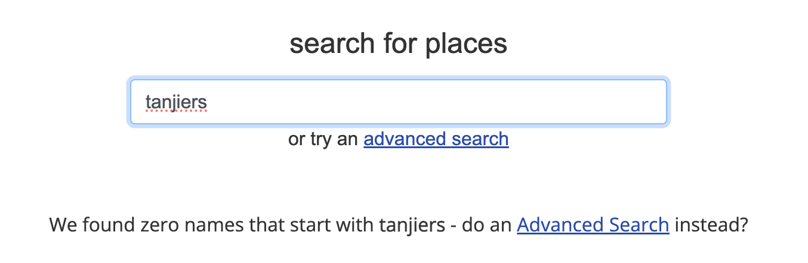

    ... so your next stop is to just search Google. I searched "tanjiers pleiades" and the first hit was "[Tingi: A Pleiades place](https://pleiades.stoa.org/places/275736)." After quickly confirming that this is probably the right place (it's located in modern-day Tangier, Battuta's home city), I'm going to copy the **Canonical URI for this page** – `https://pleiades.stoa.org/places/275736` – and paste it into the `uri` column of my spreadsheet.

2. Repeat this as you read until you have 5 records in your spreadsheet with values for both `name` and `uri`.
3. Once you have your 5, save your spreadsheet as a `.csv` to your `data` folder, name it `battuta_places.csv`, and close Excel.
4. Return to ArcGIS Pro and from the **Map** tab, select "Add Data" ➡️ "Data" ➡️ select `battuta_places.csv`.  -->

<!-------------------------------------[ Links ]
---------------------------------------->

[l]: #

<!---------------------------------[ Buttons ]--------------------------------->

[imp]: https://img.shields.io/badge/IMPORTANT!-red?style=plastic
[q]: https://img.shields.io/badge/Question-blue?style=plastic