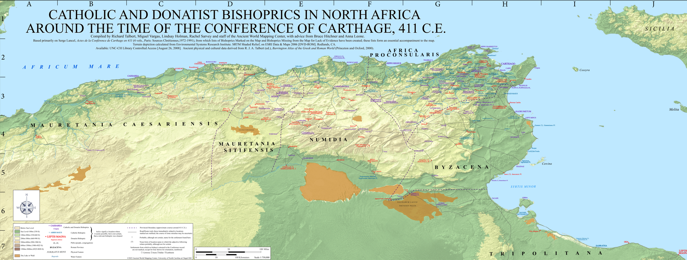

# **Activity 01: Mapping ancient places** <!-- omit in toc -->
*Use a gazetteer of the ancient world to make sense of XY data and coordinate systems*

|                                                            |
| :---------------------------------------------------------------------------------------: |
| *A map of ancient places, created with help from [Pleiades](https://pleiades.stoa.org/)*. |

This activity will be published by Tuesday, 1/30.