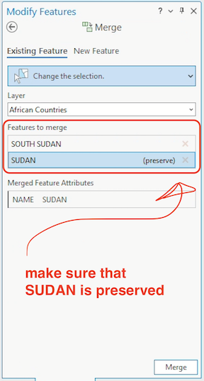

# Activity 02: Historic population in Africa, 1850-1950 <!-- omit in toc -->
*Understanding quantitative cartography and interpolated sources with historic population data*

|  |
| :----------------------------------------------------------------------------------------------------------------: |
| *Africa ([1600?]), from [Library of Congress Geography and Map Division](https://www.loc.gov/resource/g8200.ct001451/?r=-0.394,-0.031,1.779,0.88,0)* |

# Table of contents <!-- omit in toc -->

- [Introduction and context](#introduction-and-context)
- [Set up your workspace](#set-up-your-workspace)
- [Download the activity data](#download-the-activity-data)
  - [Tabular data](#tabular-data)
  - [Feature data](#feature-data)
  - [Load the data](#load-the-data)
- [Making the data work for you](#making-the-data-work-for-you)
  - [Dissolving by field](#dissolving-by-field)
  - [Deleting spurious geometries with field calculator](#deleting-spurious-geometries-with-field-calculator)
  - [Merging features](#merging-features)
- [Joining your data](#joining-your-data)
  - [The table join](#the-table-join)
  - [Determining a suitable common field](#determining-a-suitable-common-field)
  - [Building the common field](#building-the-common-field)
  - [Complete the join](#complete-the-join)
- [Classification](#classification)
- [Activity deliverables](#activity-deliverables)

# What you should submit <!-- omit in toc -->

Before **6:30pm on Tuesday, 2/20**, you should submit to Canvas:
* A document in `pdf` or `docx` format, answering all the questions that are tagged with ![q], and which are summarized in the [activity deliverables](#activity-deliverables) section
* A map in `png` format, exported at 300 DPI, as directed at the end of the lab

# Introduction and context

This activity will walk you through techniques and best practices associated with representing quantitative and qualitative geographical data using ArcGIS Pro. You'll use a pre-processed dataset that interpolates population data for African countries to visualize population change over the course of a century across the entire African continent.

Major learning objectives include:
* best practices in cartographic representation
* distinguishing between kinds of maps
* understanding visual hierarchy
* assessing map variables
* basic color theory
* table joins

# Set up your workspace

At this point, you should be getting pretty good at starting a new project in ArcGIS Pro. Follow these instructions to set up your workspace:

1. First, I recommend creating a directory in your `H: drive` for `week04`, and inside that directory, make two folders for `data` and `workspace`. When I do this, it resembles:

        ├─ gisusers$ (H:)/   
          ├─ week03/   
            ├─ lab02_slave-trade/
              ├─ workspace/
              ├─ submission/

    You should pick a directory structure that makes sense for how you work, but the key thing to bear in mind is to pick a structure that is as *futureproof as possible.*

    To give a concrete example, I like to store my original datasets in a separate `data` folder in case I accidentally corrupt my data and need to get a fresh copy.
2. Open **ArcGIS Pro**.
3. Sign in with your ArcGIS organization URL.
4. Start a new project by clicking **Map**.
5. Name your project something like `activity02_africaHistoricPop`.
6. Save the new project in your `workspace` folder, leaving the "Create a new folder for this project" box checked.

You should now be looking at a fresh ArcGIS Pro project, with the two default layers of a world hillshade and world topo map.

# Download the activity data

In this activity, you'll be working with two kinds of geographic data in this activity: **tabular data** and **feature data**.

Tabular data refers to data that is saved in table or spreadsheet format. Commonly you'll encounter this as an `xls` or `csv` file. Tabular data is "geographic" when it contains geographic indicators – such as latitude and longitude or an address – but that doesn't mean it's *spatial* data. In order to display it in a GIS like ArcGIS Pro, there are further steps we need to take. Right now it's only *describing* these geographies.

Feature data refers to data that is encoded in a spatial format. Common spatial formats include the shapefile (`shp`), GeoJSON (`geojoson`), and geodatabase (`gdb`). All of these formats contain structured spatial data that can be read inherently by many geographic information systems without any further processing. When you load spatial data into ArcGIS Pro, it is automatically recognized and can be instantly plotted as features on the map; hence, *feature* data.

> ![imp]
>
> Almost always, feature data contains some kind of tabular data as well, usually in the form of an **attribute table** like the kind you explored extensively in Lab 02.

## Tabular data

Download the tabular data containing estimated populations in African countries between 1850 and 1950 from Canvas.

It's a slightly processed version of [this dataset](https://dataverse.harvard.edu/dataset.xhtml?persistentId=hdl:1902.1/15281&studyListingIndex=3_bbe301ac817a8f240616b94fcc83). The author has written (Manning 2010:246) about why he composed this dataset:

> The findings... draw attention to the widespread assumptions of past observers that African populations were relatively small and that they were growing rapidly—in both colonial and precolonial eras. These pervasive assumptions were more than demographic estimates: they emerged out of ideologies that treated African societies as technically backward, politically immature, and socially elemental. Such views of African societies enabled observers to make aggregate generalizations without exploring the details of African social interaction.

When you encounter a new dataset, your first questions should always be: why does this exist? Where did the data come from? How was it computed? If you want, you can read more about how this dataset was actually created in Appendix A of the original `xls` spreadsheet: <https://doi.org/10.7910/DVN/ZP3PP1>

Take a moment to open this dataset in Microsoft Excel. You should see something like:

## Feature data

There are lots of places where you could download spatial data of African countries. For this activity, we'll use [Stanford University's EarthWorks portal](https://earthworks.stanford.edu/), a massive discovery tool for geospatial data. (Alternatives include the [Tufts GeoData portal](https://geodata.tufts.edu/), [Harvard's Dataverse](https://dataverse.harvard.edu/), [Princeton's Maps & Geospatial Data Portal](https://maps.princeton.edu/?utf8=%E2%9C%93&search_field=all_fields&q=&featured=geospatial), and the [Big Ten Academic Alliance's Geoportal.](https://geo.btaa.org/))
1. Go to [EarthWorks](https://earthworks.stanford.edu/)
2. Search for `africa country boundaries`
3. Click "Detailed World Polygons (LSIB), Africa, 2013" – it should be the first hit
4. Export it as a `shapefile`

    
5. It will download as a `zip` file. Extract it and move the contents into your `data` folder
6. Delete any spurious folders before you load the data into ArcGIS

## Load the data

Go ahead and bring the feature data (countries) into ArcGIS Pro, either by:

1. **Map** tab ➡️ "Add Data" 
2. **Catalog** pane ➡️ navigate to your `data` folder (or wherever you saved the data) ➡️ drag and drop from **Catalog** into map/data frame

Then, add the tabular data (spreadsheet) using the same method. Once you're done, you should see both layers displayed in your **Contents** pane, which will have a new category for "standalone tables":

Open the `africa_pop_est_1850-1950_cleaned` file by **right-click** ➡️ "Open" (or `ctrl`+`T`). Some general observations:
* there are 49 records – just a few less than the total number of African countries today (54) – so we can expect the final products to have a few regions of no data
* for now, `gisname` field is supposed to be empty
* `ST_region` means "Slave trade region"
* `pop_` columns show decennial population estimates, and they don't seem to follow changes in historical geographies; rather, they're all mapped to modern territorial boundaries

Although *we* understand intuitively how this "standalone table" should be mapped – e.g., we want to associate the values in the `pop_` columns with geographic features on the map, based on the country name – that isn't enough for ArcGIS Pro. **A country name is not inherently spatial data: it's just geographic information.**

Turning geographic information into spatial data is one of the most fundamental and powerful aspects of GIS software. Typically, we call the process of connecting tabular data with spatial data a **table join** – but before we get to that workflow, let's take a moment to explore our spatial data as well.

# Making the data work for you

Even the tidiest datasets will often need further pruning, massaging, and TLC. Our two datasets for this activity are no exception.

Take the countries shapefile, for instance, currently displayed as `Africa` in your contents pane. Now might be a good time to rename the layer to something like "African Countries," which I'm going to do.

Open the `African Countries` layer's **attribute table**.

Hachi machi! Why, pray tell, are there nearly 5,000 records in this shapefile of African countries?

Go ahead and zoom into one of those features by **double-clicking** on the table row number on the attribute table's left-hand side...

... and you'll probably find yourself looking at a tiny polygon off the coast, like this:

In addition to being pretty [heavily generalized](https://www.axismaps.com/guide/scale-and-generalization), as the jagged edges along the coast suggest, this shapefile appears to have encoded *every little island off the coast as a separate record*.

There's nothing wrong with that per se, but for our purposes today, that's *way* too detailed: ideally, we just want a shapefile that contains one record for every country in the African continent.

Two methods come to mind for making this data work for you.

## Dissolving by field

ArcGIS Pro offers a wide range of **geoprocessing** tools for data management. A classic is **Dissolve**.

**Dissolve** aggregates features based on specific attributes. For example, the abstract illustration below consolidates features of like color into a single geometry:

|  |
| :--------------------: |
| *Dissolve tool, from [Esri](https://pro.arcgis.com/en/pro-app/latest/tool-reference/data-management/dissolve.htm)* |

Let's make that abstract example more concrete by applying it to the `African Countries` layer.

1. Open the **Dissolve** tool by clicking into the **Analysis** pane ➡️ click **Tools**

    

2. Search for the **Dissolve** tool by typing "dissolve" into the search bar of the **geoprocessing pane** that opens. Click **Dissolve**.

    

3. Set the tool's parameters like so...
   
   1. Input features =  `African Countries`
   2. Output feature class = `AfricanCountries_Dissolved` – save this to `africanHistoricalPopulation.gdb`
   3. Dissolve fields = `NAME`
   4. ![imp] Make sure you clear  any records that might be selected. If you have any records selected, *the geoprocessing operation will only be performed on them.*
   
   ... and click **Run**.

4. Now you should have a new layer in your **contents** pane for `AfricanCountries_Dissolved`. Open its attribute table – you should now see only 70 records.

    

5. Select one of the records and zoom into the coast until you find a few islands. Notice how *all* the geometries that shared a value in the `NAME` field have been consolidated even if they're not touching one another. This is called a **multipart feature** – or a single feature that contains noncontiguous elements and is represented in the attribute table as one record – and it's a common result of running the **Dissolve** tool: 

    |  |
    | :-----------------------------: |
    | *The coast of Algeria as a multipart feature*  |

> ![q]
>
> 1. There are 54 countries in Africa and our dissolved layer has 70 – still more records than we would expect. Use the attribute table to figure out why that is, and write down an example of a feature that is inflating the feature count. Why does it seem like this feature exists? Do you think you need to keep it for this exercise?

## Deleting spurious geometries with field calculator

The **Dissolve** tool is a handy way to automate consolidating features, but sometimes it's important to get a little bit more precise. For example, let's say we didn't want to include all those little islands along the coast *at all* – can we just delete them?

Obviously, you wouldn't want to pan through the map, selecting and deleting all nearly 5,000 extra geometries by hand. To delete these features quickly, you'd want to:
1. compute their area using the **field calculator**
2. sort the attribute table by that new field
3. manually remove features you don't want

Let's try...

1. Close the attribute table for `AfricanCountries_Dissolved` and open the attribute table for your original shapefile, `African Countries`
2. Click the "Add" button in the header of the attribute table.
3. Fill out the fields so that
   1. Field Name = `area`
   2. Alias = `area`
   3. Data Type = `double`
   4. Number Format = `Numeric`
   
   And save it, either with the **Save** button in the **Fields** tab at the top of your screen or by **right-clicking** in row itself and choosing "Save" (as highlighted below).

   

4. Back in the attribute table for `African Countries`, **right-click** the `area` ➡️ "Calculate Geometry". This will automatically open the **Calculate Geometry** geoprocessing tool. Set the parameters to:
   1. Input Features = `African Countries`
   2. Field = `area`, while Property = `Area (geodesic)`
   3. Area Unit = `Square kilometers`
   4. Coordinate System = `GCS_WGS_1984` (you can select this by clicking on the graticule  icon next to the box)
5. Click **OK** and you should see the `area` field populate with a bunch of values. **Go ahead and sort those values in descending (highest to lowest) order** with **right-click** ➡️ "Sort Descending".

> ![q]
>
> 2. Scroll through the attribute table and examine the sorted data, double-clicking on record numbers to zoom into different features. Is there a break point after which it seems like you could delete most of the smaller features without erasing any actual countries? Where is that break point, and why did you choose it? Specify it with the record number and FID (e.g., "Record #90, FID `3500`.")

For the purposes of this activity, we'll proceed with the dissolved layer. Go ahead and remove the `African Countries` layer from your project and rename `AfricanCountries_Dissolved` to `African Countries`...

## Merging features

... but one last thing before you proceed.

While most of the tabular data we'll be working with in this activity maps directly to modern geographical boundaries in Africa, there is one exception: **Sudan and South Sudan**. We'll need to merge these two features together in order to properly join the data later on.

To merge these two features:

1. Select them both from the map (hold down the `shift` key while clicking with the **selection** tool):

    

2. Click the **Edit** tab and then click the **Modify** button.

    

3. The **Modify** pane should open up on the right-hand side of your screen. Search for "merge" in the toolbar, and a "Merge" function should pop up in the **Construct** category. Click it.

    

4. **With your two features selected,** set the parameters so that:
   1. Layer = `African Countries`
   2. Features to merge = `SOUTH SUDAN` and `SUDAN`
   3. Under *Features to Merge*, Click on `SUDAN`
   4. Click **Merge**

      

5. Once you've **merged**, you should see something like this:

    

    Notice how there's still a little section of Central Sudan that has been left separate? Using the skill you just learned, merge that feature into the country boundary for Sudan. 
    
    > ![imp]
    > 
    > **Be sure to preserve the features for `SUDAN`, *not* `In dispute SOUTH SUDAN/SUDAN`**.

# Joining your data

## The table join

The table join is a crucial GIS workflow. Esri [describes it as such](https://pro.arcgis.com/en/pro-app/3.1/help/data/tables/joins-and-relates.htm):

> Through a common field, known as a key, you can associate records in one table with records in another table. For example, you can associate a table of parcel ownership information with the parcels layer, because they share a parcel identification field.
> 
> You can make these associations in several ways, including by joining or relating tables temporarily in your map or by creating relationship classes in your geodatabase that maintain more permanent associations. Joins can also be based on spatial location.

|  |
| :---------------------------: |
| *A drawing showing how attributes (the numbers) and features (the shapes) are joined together. The dotted lines represent the "common field" that links the two data (by [Tess McCann](https://cartinal.leventhalmap.org/guides/making-sense-maps-data/session-2/part-4.html#how-do-features-and-attributes-get-together), 2021)*.|

This is precisely what we want to do with our data: we want to join the "standalone table" of population data to the `African Countries` layer.

| ![imp] |
| :- |
| Joins only work if the common identifier is ***exactly the same in both tables***: there can be ***absolutely no differences*** between the common field's *value* in either table, or else the data for that record won't be joined. For example, `Senegal` would not join to `SENEGAL` because the latter is all caps. For this reason, it's typically ideal to use a numerical key rather than a string (e.g., text-based) key.|

Moving forward, the major question is, do we have a common field in our two tables?

## Determining a suitable common field

Because we explored the attribute tables earlier, we know there is information for country name in both tables. Let's find out how suitable those fields would be as a common field.

1. Open both attribute tables, one for the `African Countries` layer and one for your standalone table `africa_pop_est_1850-1950_cleaned`
2. Click and drag one of those tables into the side-by-side view (an option for "pinning" the table in various locations should open up once you're begun to drag it), as shown in the gif below:

    

3. Sort the `NAME` field in the `African Countries` table in alphabetical order, from first to last (you can do this by double-clicking on the field name). Do the same with the `territory` field in the `africa_pop_est_1850-1950_cleaned` table.
4. Scroll through, comparing the two fields.

> ![q]
>
> 3. Why won't this work as a common field for our table join?

## Building the common field

It looks like we're going to have to make a common field on our own. Although working with data across a historical time range does make this a little more complicated than normal our goal remains pretty straightforward: **we want to populate the `gisname` field in the `africa_pop_est_1850-1950_cleaned` tablae with values that conform exactly to the `NAME` field of the `African Countries` layer**. 

To accomplish this, we will:
1. Use Microsoft Excel to copy values from the `territory` field into the `gisname` field
2. Read through the new `gisname` values and conform them to the `NAME` field, correct any spelling or nomenclature discrepancies

Let's get started...

1. First, open `africa_pop_est_1850-1950_cleaned` in Microsoft Excel. (You might need to right-click on the file and select "Open with"...)
2. Go back to ArcGIS Pro. Select all the records in your `Africa Countries` layer and click the **Copy** button in the header of the attribute table.

    

3. Paste the copied values somewhere in your Excel spreadsheet. Here's where I dumped mine:

    

    Temporarily, we're going to start treating our Excel spreadsheet like more of a scratch pad than a data spreadsheet. We'll move a bunch of things around, with the goal of making the currently empty `gisname` field conform *exactly* to the `NAME` field to which we want this data joined. By the time we're done, it will be fully joinable and **GIS friendly**.
4. Now, right-click on the header above the `NAME` field, and select "Copy". That field was in the `R` column for me, but it might be in a different column for you.

    

5. Once it's copied, right-click on your `territory` field – it should be the `A` column – and click "Insert copied cells." This will paste the copied column *to the left* of the existing data.

    

    Now you should have a list of the *destination field* (e.g., the `NAME` field to which we want to join our spreadsheet data) right next to the *input field* (e.g., the `territory` field that we must conform to the `NAME` field before it's actually joinable).

    You can delete the leftover cells copied from ArcGIS Pro. Your screen should resemble:

    

6. Click into the `Q2` cell – it should be to the right of your data – and paste the following expression:

        =UPPER(B2)

    This expression will paste the value from the `B2` cell into the `Q2` cell, but capitalized.

7. **Copy** the `Q2` cell itself by right-clicking on the cell ➡️ "Copy" (or `ctrl`+`V`) and then **paste** the contents into cells `Q3:Q50` (using either right-click ➡️ "Paste" or `ctrl`+`V`), as shown in the GIF below:

    

8. Now that you have all your values capitalized, it's time to paste them where they belong. Copy the new column (cells `Q2:Q50` for me) and select the pasting destination: the `gisname` field, column `C`, cells `2:50`.

    **Instead of pasting normally, right-click in the highlighted cells (`C2:C50`) and select "Paste Special" ➡️ "Paste Values"**. If you don't choose this option, the formula – e.g., `=UPPER(B2)` – will be pasted instead of the values.

    Again, the GIF below demonstrates:

    

9. Okay, now here's the really annoying part: go through every value in the `gisname` column and compare it to its corresponding value in the `NAME` column to ensure that `gisname` is *exactly the same* as `NAME`. If the two values differ, update `gisname` to match the value in `NAME`.

    To make this even a little easier, you could cut the `NAME` column and insert it to the left of the `gisname` column like so:

    

    You can also delete the islands and disputed territories – not because they aren't important, but because they won't be visible at the scale we're mapping this data:

    

    Lastly, a couple of important notes on nomenclature for data from the spreadsheet:
    * "Dahomey" refers to modern-day Benin
    * "Tanganyika" refers to modern-day Tanzania
    * "Spanish Sahara" refers to modern-day Western Sahara
    * "Upper Volta" refers to modern-day Burkina Faso
    * "Ivory Coast" refers to Cote D'Ivoire
    * Pay attention to Guinea, Guinea-Bissau, and Equatorial Guinea – three different countries
    * Pay attention to Gambia, which is named `THE GAMBIA` in the `African Countries` table
    * Bear in mind that some islands that are present in the `African Countries` data (like Cape Verde) aren't present in the `africa_pop_est_1850-1950_cleaned` table – that's okay

    > ![imp] 
    > 
    > **Do not change any of the `NAME` column values – they are simply reference cells for the `African Countries` layer. Only change values in the `gisname` column.**

10. Once you're done, you can delete the `NAME` column from your spreadsheet. The final product should resemble:

    

## Complete the join

To complete the join, open ArcGIS Pro and...

1. Remove `africa_pop_est_1850-1950_cleaned` and re-add it from the **catalog**, just to make sure our latest changes are reflected in the file path that ArcGIS Pro is reading
2. We want to join the standalone table `africa_pop_est_1850-1950_cleaned` to the `African Countries` Right-click on the `African Countries` layer ➡️ "Joins and Relates" ➡️ "Add Join"

    

3. When you click "Add Join," a new dialog box will open up. Fill it out like so:

    

4. Click **Validate Join**. This prints a dialog that shows how many records will be joined. Towards the bottom of that box, you should be able to find something like this message:

        Checking for join cardinality (1:1 or 1:m joins)...
        A one - to - one join has matched 49 records.
        The input table has 68 and the join table has 49 records.
    
    Nice – it sounds like all 49 records from the data should join successfully!
    
    That word **cardinality** is describing the nature of the relationship between the input and join tables: is it **one-to-one** (1:1), in which one record in one table is associated with a single record in the other table, or **one-to-many** (1:m), in which one record in one table is associated with multiple records in the other table?
    
    You can also have **many-to-many** (m:m) cardinality, which 🥵. We don't need to dive deeply into cardinality today, but it's good to be familiar with the term.

    Anyhoo: let's click **OK** to process the join.

5. If you open the **attribute table** for the `African Countries` layer, you should now see a bunch of new fields from our join table – woohoo and congratulations! **You've just successfully completed a table join, by using a common identifier (country name) to attach tabular attribute data (e.g., decennial population estimates) to spatial feature data (African country boundaries).**

    

    Some of the records have values of `<Null>`, which is okay – it just means there was no joinable data for that record.

    In the next section, we'll discuss how to classify this data.

# Classification

# Activity deliverables

<!-------------------------------------[ Links ]
---------------------------------------->

[l]: #

<!---------------------------------[ Buttons ]--------------------------------->

[imp]: https://img.shields.io/badge/IMPORTANT!-red?style=plastic
[q]: https://img.shields.io/badge/Question-blue?style=plastic
[qs]: https://img.shields.io/badge/All_Questions-blue?style=plastic