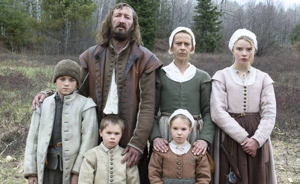

# **WITCHCRAFT!**
*Using data classification to make cartographic propaganda*

|  |
| :-: |
| *The Salem Witch House, built 1642, from the [Boston Public Library Arts Department](https://www.digitalcommonwealth.org/search/commonwealth:6d570w881)*. |

# **Introduction & context**

"The goat is loose again, William!" cries your wife from across the hall. *Not again*, you think. In your rush to stand up, you knock over a jar of the herring you were pickling. The air is pierced twice: first, when the glass breaks, and then again, a moment later, when the baby – your baby, sweet Samuel – begins to wail. There will be Hell to pay for that later, but for now, you have a goat to catch.

I've got bad news: you are a 17th century New England yeoman peasant and settler colonist. Between chasing down your shank of a goat and feuding with the neighbors (they are heretics, in your opinion), you barely have time to think about how much your life has really *sucked* lately. The dirt is cold, the sky is grey, and you have no idea just how righteously history will condemn you and your family for your despicable sins against the indigenous stewards of the land upon which you've just built your barren farm and drafty cabin. Your wife Katherine, teenage daughter Thomasin, preteen son Caleb, and young fraternal twins Mercy and Jonas were recently banished from a Puritan settlement over a religious dispute. One day, after your newborn son Samuel suddenly disappears while under Thomasin's care, you begin to suspect there is something dangerous lurking in the secluded woods near your farm, and ...

... whoops. Sorry, I got a little mixed up. That's the plot to Robert Eggers' critically acclaimed 2015 film *The VVitch* – not instructions for this week's assignment. But hear me out: while this week's assignment doesn't deal with disappearing infants or fugitive livestock, it *does* deal with witches, and I *will* need you to occupy the headspace of a 17th century peasant while you work on it. Let me explain.

# **Objectives**

Between the 16th and 18th centuries, thousands of people were accused of witchcraft during a [social panic](https://en.wikipedia.org/wiki/Witch_trials_in_early_modern_Scotland) in Scotland. Today, we know them as the early-modern Scottish witch trials.

You, an 18th-century Scot, have been meticulously tracking data on where witches have been accused accross the region. Your incredible foresight compelled you to encode the data in a `csv` that contains a **join field**, making it easy to map.

In this assignment, you'll take what you learned about cartographic best practices – as well as all the other stuff we've discussed throughout the last 4 weeks – and apply it to create a pair of maps that will use the **same data** to tell **different stories** about the Scottish witch trials.

More specifically, you will:
* **Join** tabular data to feature data
* **Utilize** classification techniques to show how data can be used to tell different stories that are often at odds with one another
* **Create** two map layouts using good cartographic principles (or strategically breaking them) to demonstrate these thematic mapping techniques

# **Requirements**

Create two maps using the same exact data, but telling very different stories:
* **Map 1** should make us believe that witches are a serious problem on the rise for Scotland.
* **Map 2** should calm our nerves, insisting that there's nothing, really, to worry about.

# Things your map must include
The following items are required for both maps you submit:
* A homemade basemap (for this assignment, you can't use a standard ArcGIS Pro basemap)
* A title
* A legend
* Some sort of inset map
* Accused witches by parish, represented appropriately for the message
* Some kind of "propogandistic" accompanying text
* Labels, where appropriate

Optionally, you could include things like:
* a scale bar and/or a north arrow
* archival objects about the Scottish witch trials ([HathiTrust](https://www.hathitrust.org/) and [Internet Archive](https://archive.org/) are good places to start)

# Things you should consider when making your map
* How to use color to convey meaning
* What kind of font and font placements are useful for getting your message across
* How you can use scale to bolster your argument
* Which classification schemes will help get your points across

# Things we'll dock you points for
* Parishes with "no data" use the same symbology as areas with `0` values
* Including a pre-made basemap
* "Data speak" in your legend – e.g., titles like `accused_witches_scotland`

# Download the data
* [Accused witches in the Scottish witch trials](https://witches.is.ed.ac.uk/resources/) (this is from Canvas)
* [Scotland's civil parishes in 1930](https://www.nrscotland.gov.uk/statistics-and-data/geography/our-products/other-national-records-of-scotland-nrs-geographies-datasets/historic-civil-parishes-pre-1891)
* [Various land and water features from Natural Earth](https://www.naturalearthdata.com/downloads/10m-physical-vectors/) (for basemap purposes)
* [Shaded relief data from Natural Earth](https://www.naturalearthdata.com/downloads/10m-raster-data/10m-natural-earth-2/) (also for basemap purposes)

# **Examples**

Before you start working on this assignment, check out this pair of maps that [Daniel Huffman](https://somethingaboutmaps.wordpress.com/about/) created for the Leventhal Map & Education Center (LMEC).

I highly encourage you to look through [these additional examples of similar maps](https://www.leventhalmap.org/digital-exhibitions/bending-lines/how-to-bend/data-stories/) from the Leventhal Map & Education Center.

You should feel empowered to borrow liberally from the styles, techniques, and tropes that these mapmakers used. Imitation is the sincerest form of flattery!

# **Submit**

Submit the assignment via Canvas before class time on **Tuesday, February 20**. Your map should be uploaded at 300 DPI in `png` format.

<!-- ## It moves

Good design catches our attention, but it also tells a story. In Frank Chimero's *[The Shape of Design](https://shapeofdesignbook.com/)*, he writes:

> What is the marker of good design? It moves.

By "moves," Chimero does not mean that it needs to move literally. The thing can also be perfectly still, so long as it moves *you*. Of course, some good design does indeed move literally, as in the map above. This collaborative project, published by *High Country News*, investigates expropriated indigenous land in what's now known as the United States that was granted to universities through the Morrill Act in 1862. 

What makes maps different from other kinds of visual communication is their representation of place. When we see a map, we tend to place ourselves in it or on it or somewhere in relation to it. Imperfect though they may be for capturing the fine-grained, lived experiences of people in places, maps remain some of the best tools we have for the job.

This week, we focus on design. Good design is an important part of making good maps with strong arguments. And while the idea that something can be designed "well" or "good" – that is to say, aesthetically pleasing – is itself deeply subjective, there are, of course, general principles of cartographic design that you should know. This includes theoretical principles, such as...

* basic color theory
* figure-ground relationships
* data classification schemes
  
As well as technical skills and practical knowledge including...

* when & how to generalize data
* when to use a serif vs. sans-serif font
* labeling and text hierarchies
* strategies for titles and supporting text
* map layout

More often than not, you will want to follow these principles when representing spatial data – but just as importantly, you should be familiar with them so that you know when to bend them, break them, and replace them. -->