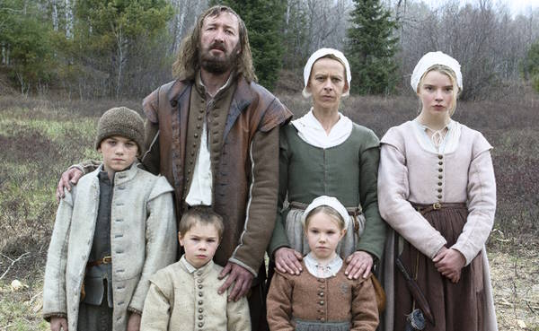

# **WITCHCRAFT!**
*Using data classification to make cartographic propaganda*

|  |
| :-: |
| *The Salem Witch House, built 1642, from the [Boston Public Library Arts Department](https://www.digitalcommonwealth.org/search/commonwealth:6d570w881)*. |

# **Introduction & context**

"The goat is loose again, William!" cries your wife from across the hall. *Not again*, you think. In your rush to stand up, you knock over a jar of the herring you were pickling. The air is pierced twice: first, when the glass breaks, and then again, a moment later, when the baby – your baby, sweet Samuel – begins to wail. There will be Hell to pay for that later, but for now, you have a goat to catch.

I've got bad news: you are a 17th century New England yeoman peasant and settler colonist. Between chasing down your shank of a goat and feuding with the neighbors (they are heretics, in your opinion), you barely have time to think about how much your life has really *sucked* lately. The dirt is cold, the sky is grey, and you have no idea just how righteously history will condemn you and your family for your despicable sins against the indigenous stewards of the land upon which you've just built your barren farm and drafty cabin. Your wife Katherine, teenage daughter Thomasin, preteen son Caleb, and young fraternal twins Mercy and Jonas were recently banished from a Puritan settlement over a religious dispute. One day, after your newborn son Samuel suddenly disappears while under Thomasin's care, you begin to suspect there is something dangerous lurking in the secluded woods near your farm, and ...

... whoops. Sorry, I got a little mixed up. That's the plot to Robert Eggers' critically acclaimed 2015 film *The VVitch*, not instructions for this week's assignment. But hear me out: while this week's assignment doesn't deal with disappearing infants or fugitive livestock, it *does* deal with witches, and I *will* need you to occupy something of a 17th century New England headspace while you work on it. Let me explain.

# **Witchy objectives**

Between 1692 and 1693, over 200 people were accused of witchcraft during a [social panic](https://en.wikipedia.org/wiki/Social_panic) across Massachusetts. They were known as the Salem Witch Trials.

You, a 17th century New Englander, have been meticulously tracking data on where witches have been accused accross the region. Your incredible foresight compelled you to encode the data in a `csv` format, even including latitudes and longitudes, making it easy to map. You're saving the data here.

In this assignment, you'll take what you learned about cartographic best practices – as well as all the other stuff we've discussed throughout the last 3 weeks – and apply it to create a pair of maps that will use the same data to tell different stories about the Salem Witch Trials.

More specifically, you will:
* **Utilize** classification techniques to show how data can be used to tell different stories that are often at odds with one another
* **Summarize** point data within polygon boundaries
* **Create** two map layouts using good cartographic principles (or strategically breaking them) to demonstrate these thematic mapping techniques

# **Requirements**

Submit two maps using the same exact data. One should make us believe that witches are a serious problem for Massachusetts; the other should calm our nerves, insisting that there's nothing, really, to worry about. In other words, you are to make *propoganda maps*.

Each map must include:
* A title
* A legend
* An inset map
* Accused witches by town, represented appropriately for the message
* All data layers
* Labels, where appropriate
* Some kind of "propogandistic" accompanying text
* Optionally, you can include other cartographic accoutrements, e.g., a scale bar, a legend, a north arrow

In addition to actual *stuff* that you must include, you should consider:
* How to use color to convey meaning
* What kind of font and font placements are useful for getting your message across
* How you can use scale to bolster your argument
* How to manipulate your classification scheme for each map in order to 

Download all the data here:
* Accused witches
* Massachusetts towns
* Massachusetts waterbodies
* Hillshade
* 

# **Examples**

Before you start working on this assignment, check out this pair of maps that Daniel Huffman created for the Leventhal Map & Education Center (LMEC).

I highly encourage you to look through [these additional examples of similar maps](https://www.leventhalmap.org/digital-exhibitions/bending-lines/how-to-bend/data-stories/) from the Leventhal Map & Education Center.

You should feel empowered to borrow liberally from the styles, techniques, and tropes that these mapmakers used. Imitation is the sincerest form of flattery!

# **Submit**

Submit the assignment via Canvas before class time on February 20.
