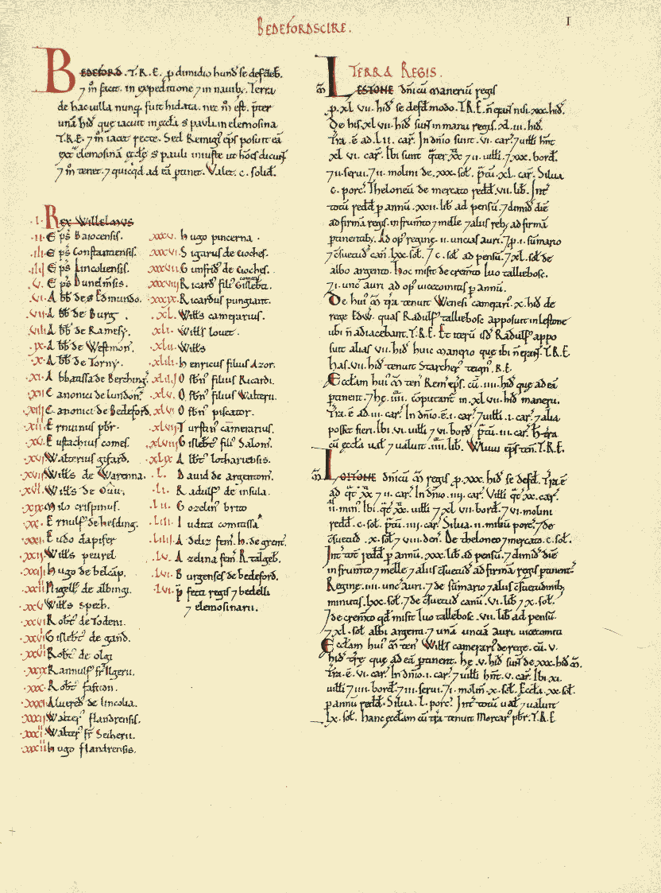

# Activity 03: Spatial data in the archive <!-- omit in toc -->

|  |
| :----------------------------: |
| *A page from the [Domesday Book](https://en.wikipedia.org/wiki/Domesday_Book) (CE 1089), courtesy of Anna Powell-Smith's [Open Domesday](https://opendomesday.org/book/bedfordshire/01/) project.* |

# Table of contents <!-- omit in toc -->

- [Introduction and context](#introduction-and-context)
- [How do you search?](#how-do-you-search)
- [Mapping two censuses](#mapping-two-censuses)
  - [China Historical GIS](#china-historical-gis)
  - [National Historic GIS (U.S.)](#national-historic-gis-us)
- [Activity deliverables](#activity-deliverables)
- [Bibliography](#bibliography)

# What you should submit <!-- omit in toc -->

Before **6:30pm on Tuesday, 2/20**, you should submit to Canvas:
* A document in `pdf` or `docx` format, answering all the questions that are tagged with ![q], and which are summarized in the [activity deliverables](#activity-deliverables) section

# Introduction and context

This activity will prompt you to think about how digital archives – the fodder for lots of humanistic geospatial research – are constructed. More specifically, you will:

* Reflect on your own search/query habits and refine them into more intentional techniques
* Understand the basic motivations behind counting people (e.g., censuses)

# How do you search?

In an essay reflecting on digital archives, Jake Hodder and David Beckingham (2022:1300-1301) argue that the tools we use today are not simply venues for looking at digital (and digitized) materials. Instead, they suggest that the tools we use for querying the internet actually inform *how we think*.

Read the excerpt below:

> If you have used a digital archive – or platforms like Google Books or JSTOR – you will be familiar with the search box that invites us to enter our ‘key terms’. It has the look and feel of a finding aid that we might use to identify a call number in a physical archive. But, as Ted Underwood (2014) argues, the underlying technology and philosophical principles are vastly different. The search bar does not help us navigate the arrangement of the archive; it allows us to circumvent it. Digital platforms privilege searching over browsing, and that searching has more in common with data mining than document retrieval. The more precise the phrasing, the more efficiently digital search can personalise our results. This is part of the nature of computer search or ‘information retrieval – it is very effective at identifying exact terms and can do so across millions of data points in seconds.
>
> When we receive our search results, fragments of historical information are recombined from multiple collections and places with little fidelity to original order or provenance. As Sassoon (cited in Sternfeld, 2011:565) notes, digital archives return results as ‘a databank of orphans which have been removed from their transactional origins and evidence of authorial intent’. Digital archives, then, offer us an unprecedented means to quickly find exactly what we were already looking for. But rarely do we know what we are looking for, even when we think we do. And even more rarely do we know the precise, historical wording that would find it. So, we search by trial and error. We enter a term as a proxy for a broader theme. We refine it. We search again. If we are lucky, we might be able to tie our research question to a distinct and historically stable watchword that reveals dozens of new sources.

This process of **recombination**, as Hodder and Beckingham call it, yields an entirely new kind of archive. When you're doing historical geographical research on/with the internet, you position yourself within and in between these hybrid archives of new and old.

When you search through these "digital archives," how do you do it? Where do you go? What kinds of terms do you use?

| ![q]      |
| :-------- |
| 1. Pick |
| 2.  |

# Mapping two censuses

## China Historical GIS

Tufts GIS has collected lots of useful spatial datasets on the `M: Drive`

## National Historic GIS (U.S.)

# Activity deliverables

# Bibliography

<!-------------------------------------[ Links ]
---------------------------------------->

[data]: https://canvas.tufts.edu/courses/54475/files/7090292/download?download_frd=1

<!---------------------------------[ Buttons ]--------------------------------->

[imp]: https://img.shields.io/badge/IMPORTANT!-red?style=plastic
[q]: https://img.shields.io/badge/Question-blue?style=plastic
[qs]: https://img.shields.io/badge/All_Questions-blue?style=plastic
[down]: https://img.shields.io/badge/Download_the_data-blue?style=for-the-badge