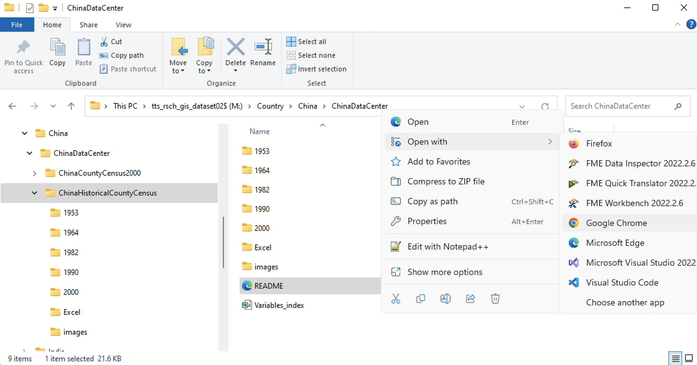
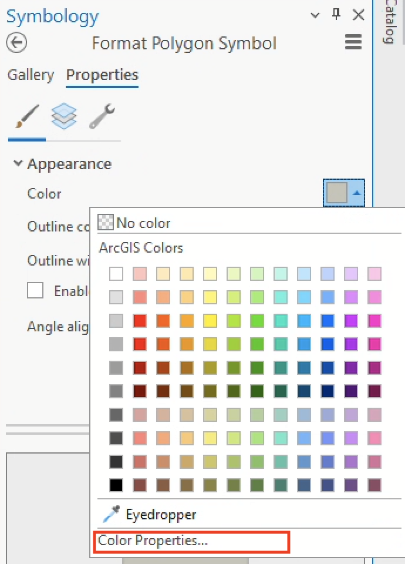
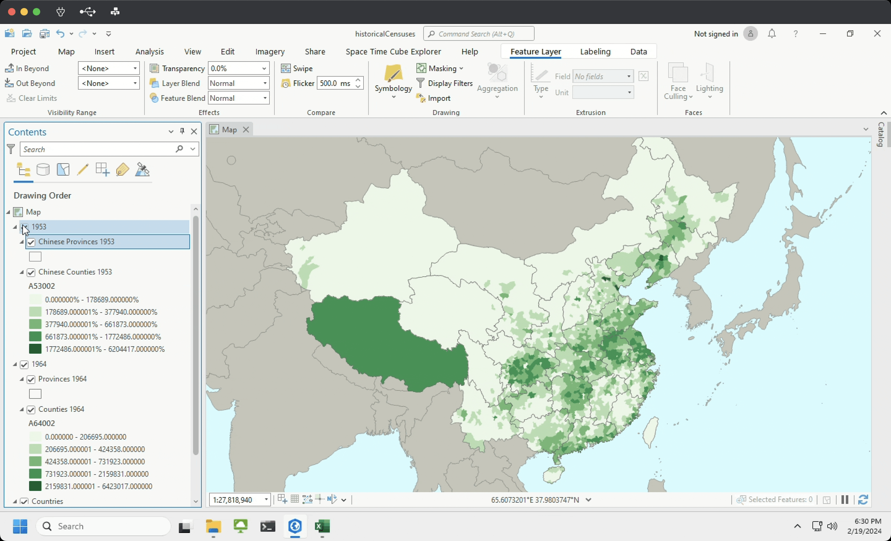

# Activity 03: Spatial data in "the archive" <!-- omit in toc -->

|  |
| :----------------------------: |
| *A page from the [Domesday Book](https://en.wikipedia.org/wiki/Domesday_Book) (CE 1089), courtesy of Anna Powell-Smith's [Open Domesday](https://opendomesday.org/book/bedfordshire/01/) project.* |

# Table of contents <!-- omit in toc -->

- [Introduction and context](#introduction-and-context)
- [Archives](#archives)
  - [Digital archives and primary/secondary sources](#digital-archives-and-primarysecondary-sources)
  - [Parsing the unruly](#parsing-the-unruly)
- [Geospatial archives](#geospatial-archives)
  - [The Domesday Book](#the-domesday-book)
  - [Modern geospatial archives](#modern-geospatial-archives)
- [China Historical GIS](#china-historical-gis)
  - [Comparing the 1953 and 1964 censuses](#comparing-the-1953-and-1964-censuses)
  - [Metadata](#metadata)
  - [Observations](#observations)
- [Activity deliverables](#activity-deliverables)
- [Bibliography](#bibliography)

# What you should submit <!-- omit in toc -->

Before **6:30pm on Tuesday, 2/20**, you should submit to Canvas:
* A document in `pdf` or `docx` format, answering all the questions that are tagged with ![q], and which are summarized in the [activity deliverables](#activity-deliverables) section

# Introduction and context

This activity will prompt you to think about how digital archives – the fodder for lots of humanistic geospatial research – are constructed. In general, you will:

* Reflect on your own search/query habits and refine them into more intentional techniques
* Learn common sources for geospatial data related to archives
* Understand the basic motivations behind counting people (e.g., censuses)

# Archives

In his essay on [the "stuff" of archives](https://read.dukeupress.edu/radical-history-review/article-abstract/2014/120/94/73309/The-Stuff-of-ArchivesMess-Migration-and-Queer), Martin Manalansan observes at least three functions (2013:94) of an archive:
1. *A repository or storage of information and documents*. This might be the most familiar definition, and one that will be familiar. They are typically organized by **provenance**, the "[fundamental principle of archiving](https://dictionary.archivists.org/entry/provenance.html)," which refers to the individual, family, or organization that created or received the items in a collection.
2. *A legitimizing instrument of power structures and prevailing authorities.* Archives don't merely document the ["order of things"](https://monoskop.org/images/a/a2/Foucault_Michel_The_Order_of_Things_1994.pdf), as Michel Foucault called it, but actually affect how things are ordered (often in the [interests of colonization](https://link.springer.com/article/10.1007/BF02435632)).
3. *A quotidian site for marginalized subjects as well as gendered and erotically charged energies, meanings, and other bodily processes.* The bulk of Manalansan's essay deals with this queer and feminist function of archives, which accounts for those everyday archives of our own making: the pile of unwashed laundry in the corner of your room, the expired food at the back of your fridge, even the strata of garbage in your trash can. 

In what ways do these functions of archives – which overlap with one another - translate in digital terms?

## Digital archives and primary/secondary sources

In an essay reflecting on digital archives, Jake Hodder and David Beckingham (2022:1300-1301) argue that the search tools we use today are not simply venues for looking at digital (and digitized) materials, but that they structure how you *search* and even inform how you *think*.

Read the excerpt below:

> If you have used a digital archive – or platforms like Google Books or JSTOR – you will be familiar with the search box that invites us to enter our ‘key terms’. It has the look and feel of a finding aid that we might use to identify a call number in a physical archive. But, as Ted Underwood (2014) argues, the underlying technology and philosophical principles are vastly different. The search bar does not help us navigate the arrangement of the archive; it allows us to circumvent it. Digital platforms privilege searching over browsing, and that searching has more in common with data mining than document retrieval. The more precise the phrasing, the more efficiently digital search can personalise our results. This is part of the nature of computer search or ‘information retrieval – it is very effective at identifying exact terms and can do so across millions of data points in seconds.
>
> When we receive our search results, fragments of historical information are recombined from multiple collections and places with little fidelity to original order or provenance. As Sassoon (cited in Sternfeld, 2011:565) notes, digital archives return results as ‘a databank of orphans which have been removed from their transactional origins and evidence of authorial intent’. Digital archives, then, offer us an unprecedented means to quickly find exactly what we were already looking for. But rarely do we know what we are looking for, even when we think we do. And even more rarely do we know the precise, historical wording that would find it. So, we search by trial and error. We enter a term as a proxy for a broader theme. We refine it. We search again. If we are lucky, we might be able to tie our research question to a distinct and historically stable watchword that reveals dozens of new sources.

This process of **recombination**, as Hodder and Beckingham call it, yields an entirely new kind of archive. When you're doing any kind of research on/with the internet, but especially historically focused research, you position yourself within and in between these hybrid archives of new and old.

Through recombination, you'll come across a variety of sources, which can mostly be sorted into two categories: **primary** and **secondary**. Per [this Tufts research guide](https://researchguides.library.tufts.edu/c.php?g=249007&p=1658227), they can be distinguished as such:

- *Primary sources* include artifacts, documents, recordings, newspaper articles, or other sources of information that were created at the time under study.
- *Secondary sources* cite, comment on, or build upon primary sources (although the distinction between primary and secondary is not hard and fast).

When you search through these "digital archives," how do you do it? Where do you go? What kinds of terms do you use? What kinds of sources are you seeking?

Here are a few tips for searching these often unruly digital archives.

## Parsing the unruly

1. **Develop search terms for keywords and subjects.** A set of foundational keywords and terms should guide any search you do. They should be firm enough to define your research topic, but flexible enough to transfer across different search databases. Depending on the database, you might want to search by [subject heading or keyword](https://guides.smu.edu/c.php?g=814523&p=6157516):

   |                  | Keywords                                                                                  | Subjects                                                                                                                  |
   | ---------------- | ----------------------------------------------------------------------------------------- | ------------------------------------------------------------------------------------------------------------------------- |
   | *Definition*       | natural language words describing your topic - good to start with                         | pre-defined "controlled vocabulary" words used to describe the content of each item (book, journal article) in a database |
   | *Flexibility*      | more flexible to search by - can combine together in many ways                            | less flexible to search by - need to know the exact controlled vocabulary term                                            |
   | *Search Scope*     | database looks for keywords anywhere in the record - not necessarily connected together   | database looks for subjects only in the subject heading or descriptor field, where the most relevant words appear         |
   | *Result Precision* | may yield too many or too few results                                                     | may yield many irrelevant results                                                                                         |
   | *Refinement*       | if too many results - also uses subheadings to focus on one aspect of the broader subject | results usually very relevant to the topic                                                                                |

   See below for a few example topics, using the [simple template provided by Tufts' Hirsh Library](https://researchguides.library.tufts.edu/ld.php?content_id=9921496). How would you fill in the rows?

   |                             | Rise of the Peloponnesian League | Geography of John Smiths | Reconstructing ancient climate data | Gender and the Salem witch trials |
   | --------------------------- | -------------------------------- | ------------------------ | ----------------------------------- | --------------------------------- |
   | *Subjects* | ???                              | ???                      | ???                                 | ???                               |
   | *Keywords*                    | ???                              | ???                      | ???                                 | ???                               |

2. **Use search operators.** Search operators help constrain and specify your search terms. For example, if you're researching the [Peloponnesian League](https://en.wikipedia.org/wiki/Peloponnesian_League), but not necessarily the Peloponnesian *War*, you could construct a search phrase that excludes results focused on the War itself. In another case, you might be researching a person whose name is [quite common across history](https://en.wikipedia.org/wiki/John_Smith), and need to add qualifying terms to your search; e.g., you don't want to include a ton of hits for [John Smith (explorer)](https://en.wikipedia.org/wiki/John_Smith_(explorer)) during your research into [John Smith (abolitionist)](https://en.wikipedia.org/wiki/John_Smith_(abolitionist)). See the table below – adapted from this guide from [Hirsh Library](https://researchguides.library.tufts.edu/hsl-advanced-searching) – for a description of each kind of search operator.

   | Operator   | Description | Example |
   | ----------------- | ----- | ------------------------------------------------------------------------------------------- |
   | *Wildcard*          | A character is used within or at the end of the word to substitute for one character or no characters. | `colo?r` retrieves documents with the words `color` and `colour`.                                 |
   | *Truncator*        | Retrieves any number of characters (including no characters) after the word stem.  | `witch$` retrieves documents with the word `witch`, as well as `witchcraft`, `witchy`, etc. |
   | *Boolean Operators* | Retrieves searches by combining terms with the use of words `AND`, `NOT`, and `OR`. Use `OR` to gather synonyms, use `NOT` to eliminate, & use `AND` to require both (or all) factors. | `map OR atlas`, `peloponnesian NOT war`, `john smith AND abolitionist`. |
   | *Bound Phrase*      | Retrieves searches for an exact match of the text with the use of quotation marks around the terms. | `"sanborn atlas"` |

   > ![imp]
   > 
   > These search operators will not always be the same across all databases. For example, Google uses a [unique set of operators](https://support.google.com/websearch/answer/2466433?hl=en) for its search engine.

3. **Go beyond Google.** Google is a great starting point for research materials, but it won't always get you where you need to go. 
   1. *[Google Scholar](https://scholar.google.com/)* is a handy resource for querying scholarly resources, including out-of-copyright books digitized by [Google's massive digitization project](https://www.theatlantic.com/technology/archive/2017/04/the-tragedy-of-google-books/523320/). I like drifting through Google Scholar with different combinations of subjects and keywords, 
   2. *Academic and public libraries* are great resources of archival materials. In addition to the libraries on Tufts' campus, you are within striking distance of dozens of magnificent public libraries with excellent historical collections in [Boston](https://archives.bpl.org/), [Cambridge](https://www.cambridgema.gov/historic/researchaids), [Somerville](https://www.somervillepubliclibrary.org/books-movies-music-etc/local-history-collection), [Medford](https://medfordlibrary.org/resources/local-history/), and more.
   3. *Digital libraries* provide ready-made access to digitized materials from all kinds of sources. [Digital Commonwealth](https://digitalcommonwealth.org) provides access to over 1 million materials including postcards, photographs, oral histories, maps, and more. Other examples include [California Digital Library](https://cdlib.org/) and [Kentucky Digital Library](https://kdl.kyvl.org/).
   4. *Specialized digital archives* (which, sure, you could argue that these are just another kind of digital library) give access to specific kinds of materials, particularly primary sources. [Fulton Search](https://www.nypl.org/research/collections/articles-databases/fulton-search-historical-newspapers) provides access to millions of scanned newspaper pages from the US & Canada, while [Google Patents](https://patents.google.com/) lets you search through over 120 million patent publications.
4. **Let yourself drift.** Use the resources above to [drift](https://en.wikipedia.org/wiki/D%C3%A9rive) through these various digital libraries & archives. Embrace the possibility of a chance encounter: as Hodder and Beckingham say, "search by trial and error... enter a term as a proxy for a broader theme... refine it... search again. If we are lucky, we might be able to tie our research question to a distinct and historically stable watchword that reveals dozens of new sources."
5. **But don't get too distracted.** Speaking from experience, it's easy to be sucked into "the archive." The [philosopher Jacques Derrida](https://www.jstor.org/stable/465144) calls this impulse *archive fever.* He says we are "in need of archives," that we "have a compulsive, repetitive, and nostalgic desire for the archive, an irrepressible desire to return to the origin, a homesickness, a nostalgia for the return to the most archaic place of absolute commencement" (1996:91). But I digress!

    If you ever feel like you are losing track of your purpose, return to your foundational search terms. What brought you here in the first place?

Before moving on to the next section on geospatial archives, answer the questions below. Think of them as an exercise in preparation for this term's final project.

| ![q]                                                                                                                                                                                  |
| :------------------------------------------------------------------------------------------------------------------------------------------------------------------------------------ |
| 1. Pick a humanistic question (e.g., a  topic) that you could answer using geospatial methods, and write it down here. (If you're stumped, think about the exercises we've completed so far. [If you're *totally* stumped, just use one of the example topics listed above.]) |
| 2. Develop a set of **subjects** and **search terms** that would help you search for this topic. Search, refine, and search again. Write the subjects and search terms here.  |
| 3. In a few sentences (3 should suffice), summarize what you found about your chosen topic, including where you searched and at least one compelling primary source. |

# Geospatial archives

## The Domesday Book

What is a "geospatial archive?" What are primary and secondary geospatial sources, and where can you find them?

To answer this question, it's useful to go back to one of the earliest sources of geospatial data that remains easily accessible today: William the Conqueror's *[Domesday Book](https://en.wikipedia.org/wiki/Domesday_Book)*, a survey of England and parts of Wales undertaken in C.E. 1086.

After the Norman Conquest of 1066, King William the Conqueror sent his agents "to measure and catalogue the realm he had won" (Rogers 2015:50). [Dallas Rogers](https://rowman.com/ISBN/9781783483334/The-Geopolitics-of-Real-Estate-Reconfiguring-Property-Capital-and-Rights) calls the survey a "mediating technology" that allowed the King to establish and enforce a land taxation system. It's not that different from other tools, like urban tax atlases or modern GIS databases for real estate, which ultimately serve the administrative purpose of collecting tax.
  
|:-:|
||
||
||
|*The Domesday Book from 1086 (top); an urban atlas from 1898 (middle); and the City of Boston's modern tax parcel viewer in ArcGIS Online (bottom).*|

The Domesday Book is an example of an extremely well-preserved census, or an official count of population. In the U.S., we use censuses to tabulate demographic data as well as determine political representation in the House of Representatives.

The [OpenDomesday project](https://opendomesday.org/) has not only made the original manuscript domesday folios available for free online, but they've also mapped them and in doing so produced a really excellent historical gazetteer. Pretty neat.

## Modern geospatial archives

In a sense, any modern spatial data object – that is, any `geojson` or `shp` file – is both a primary and seconday source. They derive from some sort of primordial source document – a map, plan, image, or census – but they also serve as the primary source for any spatial data that derives from them.

Take, for example, this spatial data of [Boston's historic shoreline](https://data.leventhalmap.org/#/catalog/dkircu2ol). Lacking a time machine, the makers of this data did not go out and survey the historic shoreline themselves, but they weren’t just making educated guesses to produce their map, either: they created it by digitally tracing, among other objects, Osgood Carleton’s [1796 plan of Boston](https://collections.leventhalmap.org/search/commonwealth:x633f8530). In turn, you could use it to make something like this [digital map of additions to Boston’s shoreline between 1795 and 1995](https://collections.leventhalmap.org/search/commonwealth:q524n4326).

While there is no overarching, canonical system for geospatial data archiving, there are all sorts of spatial data libraries that you can use to search and retrieve geospatial data. We typically call these **data portals** or **data clearinghouses**.

Here are a few general-purpose portals:
1. Tufts GeoData Portal: <https://geodata.tufts.edu/>
2. BTAA GeoPortal: <https://geo.btaa.org/>
3. Harvard Geospatial Library: <https://library.harvard.edu/services-tools/harvard-geospatial-library>
4. MassGIS: <https://www.mass.gov/info-details/massgis-data-layers>

And here are more that focus specifically on censuses:
1. The Great Britain Historical GIS: <http://www.gbhgis.org>
2. The China Historical GIS: <http://www.fas.harvard.edu/~chgis>
3. Chinese Civilization in Time and Space: <http://ccts.ascc.net>
4. Taiwan History and Culture in Time and Space: <http://thcts.ascc.net>
5.  The Belgian Historical GIS: <http://www.hisgis.be>
6.  The Historical GIS for the Netherlands: <http://nlgis.dans.knaw.nl>
7.  Historical GIS Germany: <http://www.hgis-germany.de>
8.  Russian Historical GIS: <http://www.ihst.ru/personal/imerz/bound/bounds.htm>
9.  National Historic GIS: <https://www.nhgis.org/>
10. International Censuses: <https://terra.ipums.org/home>
11. Great Britain Historical GIS: <https://borders.ukdataservice.ac.uk//licences.html>

| ![q] |
| :--- |
| 4. Find a spatial dataset (e.g., a `shp` file, a `csv` file containing geographic information like lat/long/address) that could help answer the research topic you chose in question 1. If you can't find anything, in 1-2 sentences, consider how you would go about composing your own spatial dataset to answer this topic. Where would you start? |

# China Historical GIS

Let's dive into some historical population data in ArcGIS Pro. Tufts GIS has collected lots of useful spatial datasets collected on the `M: Drive`. One of them contains historic population data for China, going back to 1953.

Last week, in [Activity 02](../../04_aesthetics/activity/historic-pop-africa.md), we worked with historic population data for the entire continent of Africa. However, **that data was not produced by a census** – it was a set of *estimated values* that a researcher created with a set of mathematical models.

In this activity, we're actually using data that came from a Census. Of course, as discussed above, 

In your File Explorer, navigate to...

    M:\Country\China\ChinaDataCenter\ChinaHistoricalCountyCensus

... and open the document titled `README`. If you double-click it, it will probably open, by default, in Microsoft Edge (🤢). You can right-click ➡️ "Open with" to open it in your web browser of choice (and if Microsoft Edge *is* your web browser of choice, you don't need to tell me, that's between you and god).

[README files](https://en.wikipedia.org/wiki/README) are a convention of metadata files. Aptly named, they typically include information that explains what's in a given directory.

Open this README file and answer the question below.

| ![q] |
| :--- |
| 5. What were the reference (e.g., [primary](#digital-archives-and-primarysecondary-sources)) sources for the 1953 and 1964 county- and province-level spatial data boundaries? |

## Comparing the 1953 and 1964 censuses

Let's compare these two censuses. Follow these steps to get the necessary data into your project.

1. Either in your Box account or your `H: drive`, make a workspace for this week's activity.
2. In that workspace, create a new ArcGIS Pro project.
3. Open your project file.
4. Open the **Catalog** pane and navigate to `M:` ➡️ `Country` ➡️ `China` ➡️ `ChinaDataCenter` ➡️ `ChinaHistoricalCountyCensus` ➡️ `1953`
5. Add the two shapefiles, `china53` and `prov53` to the project.
6. Repeat steps 4 and 5 for 1964 data.
7. Download the Admin 0 `countries` data from Natural Earth: https://www.naturalearthdata.com/downloads/10m-cultural-vectors/
8. Move the data from your `downloads` folder and into a sensible location in your workspace.
9. Add the `countries` data to your project.

Once you have the data in your project, organize it:
1. If the layers `World Topographic Map` and `Hillshade` are turned on, turn them off.
3. Give each layer a sensible name. Here's what I'll use:
   1. `china53` ➡️ `Counties 1953`
   2. `prov53` ➡️ `Provinces 1953`
   3. `china64` ➡️ `Counties 1964`
   4. `prov64` ➡️ `Provinces 1964`
   5. `countries` ➡️ `Countries`
4. In your **Contents** pane, drag and drop each layer so that they appear in this order:
   1. `Provinces 1953`
   2. `Counties 1953`
   3. `Provinces 1964`
   4. `Counties 1964`
   5. `Countries`
5. **Group** your 1953 provinces and counties together by selecting both of the 1953 layers ➡️ Right-click ➡️ "Group"

    

    This will allow you to toggle these layers on and off in groups. 
    
6. Group the 1964 layers as well.
7. Rename the groups `1953` and `1964`

Now that your data is organized, symbolize it. You know by now that there are a few ways to access the **Symbology** pane, including 1) right-clicking a layer ➡️ "Symbology," and 2) clicking on the "Feature Layer" tab in the ribbon at the top of ArcGIS Pro while the layer you want to symbolize is selected.
1. First, symbolize the `Countries` layer to be unintrusive, so that it clearly scans as a background (remember figure-ground?). I'd recommend a gray or tan, with boundaries of `0.5` width in the same color as the fill, but darker.

    To get that "just right" color, you'll probably have to click into the "Color Properties" tab of the "Color" dropdown.

    
2. Second, set the background of the map to a light, pastel blue. To do this from your **Contents** pane, right-click "Map" ➡️ "Properties" ➡️ "General" ➡️ "Background color". This will simulate water and eliminate the need to include an extra data layer. Nice!
3. Third, symbolize both of the `Province` layers so that the color is transparent (e.g., "No color") and the outline is a dark gray with an width of `0.5`.
4. Finally, symbolize the `Counties 1953` layer, following these parameters:
   1. Primary Symbology = "Graduated colors"
   2. Field = `A53002`
   3. Choose a method that makes sense for this data
   4. Choose a sensible color ramp for this numerical, quantitative data (e.g., sequential, classed, single-hue)

       > ![imp]|
       > :-|
       > Click the gear next to "Color scheme" and select "Apply to fill and outline." This will automatically apply the fill color for each feature in your data to the outline as well, de-emphasizing the internal county boundaries and giving the data a smoother appearance. This also allows us to cartographically distinguish the provinces from the counties.
5. Symbolize the 1964 data in the same fashion as the 1953 data, using the field `A64002`.

If you've grouped layers and symbolized everything properly, you should see something like this when you toggle the `1953` layer on and off:

We've got our data displayed nicely – you could even make a new "Map" tab, [like we did in Activity 02](../../04_aesthetics/activity/historic-pop-africa.md#side-by-side-comparisons), to make a side-by-side comparison of the two years – but what do the fields we're mapping, `A53002` and `A64002`, actually mean? And what else is in the attribute tables of these two datasets?

## Metadata

In the **Catalog** pane of ArcGIS Pro, navigate back to `M:` ➡️ `Country` ➡️ `China` ➡️ `ChinaDataCenter` ➡️ `ChinaHistoricalCountyCensus`.

You should see an Excel file (`.xls`) titled `Variables_index`. This file contains **metadata** for this historic demographic data.

Right-click the `Variables_index` file ➡️ "Show in File Explorer." Then, open the file in Microsoft Excel and answer the questions below using the metadata.

| ![q]                                                                |
| :------------------------------------------------------------------ |
| 6. What variable do the field names `A53002` and `A64002` describe? |
| 7. What other variable could you use to compare change between 1953 and 1964? |

## Observations

Take a moment to observe this data, toggling it on and off. 

We would need to 

South China Sea and disputed paracel island territories get associated with Guangdong in the data.

Quietly, the Natural Earth data makes a geopolitical claim – one that, I'd argue, is even further normalized by the name of the provider, "Natural Earth," which implied a degree of .

| ![q]                    |
| :---------------------- |
| ?. Take a screenshot of your ArcGIS Pro interface, showing the symbolized layers. |
| 7.  |

# Activity deliverables

# Bibliography

<!-------------------------------------[ Links ]
---------------------------------------->

[data]: https://canvas.tufts.edu/courses/54475/files/7090292/download?download_frd=1

<!---------------------------------[ Buttons ]--------------------------------->

[imp]: https://img.shields.io/badge/IMPORTANT!-red?style=plastic
[q]: https://img.shields.io/badge/Question-blue?style=plastic
[qs]: https://img.shields.io/badge/All_Questions-blue?style=plastic
[down]: https://img.shields.io/badge/Download_the_data-blue?style=for-the-badge