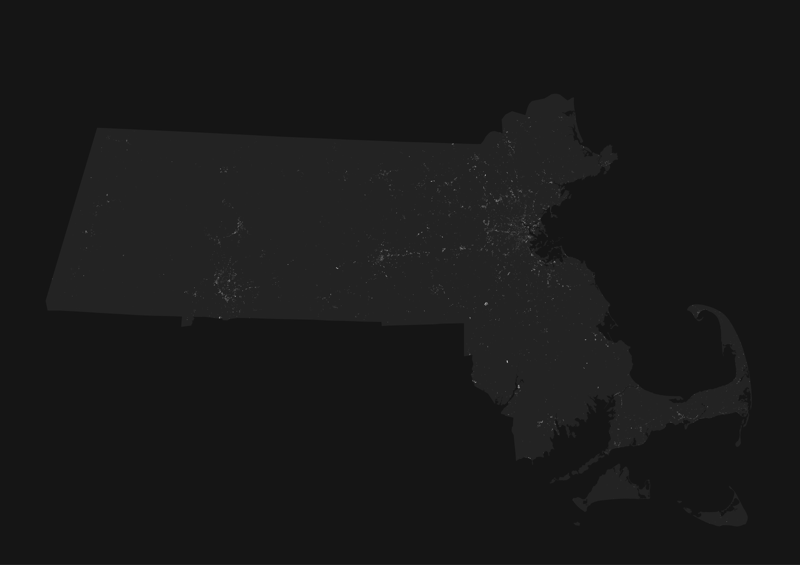
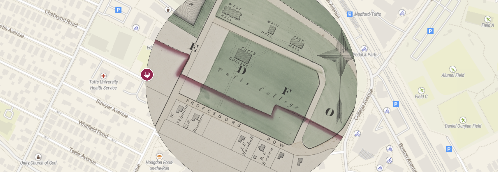

# **Assignment 02: Parking lot cemeteries** <!-- omit in toc -->

|  |
| :----------------------------: |
| *Mass parking lot cemeteries* |

# **Introduction and context**

Although parking lots only take up about 0.27% of total land area in the commonwealth of Massachusetts, that number starts to grow as you zoom into cities and towns. A back-of-the-napkin estimate using data from [OpenStreetMap](https://www.openstreetmap.org/) suggests that number goes up by a factor of ten in Boston (2.7%) – and it's much lower in Boston than most cities in the U.S.

All things considered, parking lots are a relatively new invention. The turn towards car-dependent urban planning in the twentieth century United States – galvanized by the passage of the 1956 Interstate Highway Act, which provided 90% in federal matching funds for highway construction – radically transformed how people got around. In fact, I think we can draw a direct line from the federal funding of highways seventy years ago to the red line catching on fire today. But I digress.

From a geospatial perspective, what tools exist for visualizing the imprint of parking lots American cities? Perhaps more importantly, how can we adequately assess what we lost through building them?

|  |
| :----------------------------------------------------------------------------------------------------------------------: |
| *United States system of highways (1950), from the [Library of Congress](https://www.loc.gov/resource/g3701p.ct006400/)*                                                                                                                         |

# **Objectives**

In this assignment, you'll use fire insurance and tax atlases – like those displayed in the Leventhal Map & Education Center's [Atlascope](https://atlascope.org) tool – to create a map of "parking lot cemeteries," or things that used to inhabit contemporary parking lots.

|  |
| :--------: |
|  *Tufts College in [Atlascope](https://www.atlascope.org/#/view:share$mode:glass$center:-71.11966,42.40694$zoom:17.57$base:maptiler-streets$overlay:ark:/76611/al88uzmc7), 1874*   |

With their meticulous documentation of building material and use, street names, urban morphology, and much more, urban atlases provide detailed glimpses into how places have changed over time. Originally created so that banks could [adequately assess fire insurance risk](https://www.loc.gov/collections/sanborn-maps/articles-and-essays/introduction-to-the-collection/), today they are invaluable tools for historical urban research. The [Sanborn Company](https://guides.loc.gov/fire-insurance-maps/sanborn) produced by far the most maps of this genre in the United States. The Library of Congress holds nearly 700,000 Sanborn maps, with tens of thousands of atlases digitized in their entirety.

Your task is to choose a city in the United States – one with decent coverage of fire insurance atlases – and 

# **Requirements**

Your final map should include the following:
* A visualization of "cemeteries" (a mosaicked layer of five georeferenced Sanborn atlases, clipped to parking lot data)
* Appropriate projection
* Meaningful title, subtitle, explanation of data sources, cartographer information, and date
* Somewhere on the map, the percentage of total land area occupied by parking lots – e.g., (`sq meters of all parking lots` / `sq meters of city`) * `100`
* Two inset maps that zoom into your most interesting "parking lot cemeteries"
* Accompanying text that describes what's buried underneath parking lots *in general*, as well as your two most interesting "cemeteries" (you may need to do a little extra research for this)
* Generally thoughtful cartographic design – e.g., readable font, no garish colors, good figure-ground sensibility

Note that for this assignment, you may use one of the preset "streaming" base maps from ArcGIS Pro. You could still make your own base map, but this time, you don't have to.

# Suggested workflow

Here is the workflow you should follow. Except for places where specific instructions are necessary, the workflow is only sketched out in broad brushstrokes. You will need to determine how to execute each step, using both the links provided, your existing knowledge, and your best judgment. 
1. [Georeference](https://pro.arcgis.com/en/pro-app/3.1/help/data/imagery/georeferencing-tools.htm) at least 4 Sanborn maps from an atlas of your choosing
   1. Download the maps as `TIFF` files from the Library of Congress
   2. The maps (or "plates" in the parlance of urban atlases) that you choose should adjoin one another – e.g., you shouldn't pick 4 disconnected plates from across the whole city
   3. The plates should cover a reasonably big geographic area
2. Using your 5 georeferenced maps as the inputs, [mosaic](https://pro.arcgis.com/en/pro-app/latest/tool-reference/data-management/mosaic.htm) the plates into a single layer
3. Generate a footprint of the mosaicked raster layer – lots of ways to do this. Pick one. This layer will be your "Area of interest"
4. Using [overpass turbo](https://overpass-turbo.eu/), download a `geojson` file of parking lots in your area of interest from OpenStreetMap
   1. Copy and paste this query into the overpass turbo query builder:

            way
                [amenity=parking]
                ({{bbox}});
            (._;>;);
            out;
    2. Navigate to your area of interest. Make sure that the screen is zoomed in to such an extent that your entire area of interest is visible, but not so zoomed out that you end up retrieving a ton of extra data
    3. Click **Run**
    4. Click **Export** ➡️ download the GeoJSON
5. [Convert the GeoJSON to a feature class](https://pro.arcgis.com/en/pro-app/latest/tool-reference/conversion/json-to-features.htm) and load it into your map

    While you're doing this, you might opt to remove all the fields that come down from overpass turbo. You won't need them
6. [Raster clip](https://pro.arcgis.com/en/pro-app/latest/tool-reference/data-management/clip.htm) mosaicked maps by parking lots
7. If not already present, [calculate geometry](https://pro.arcgis.com/en/pro-app/latest/tool-reference/data-management/calculate-geometry-attributes.htm) for both your parking lot and footprint layers. Then, compute how much of the area of interest is occupied by parking lots today, and include that value somewhere in your map

Once you're done with the above steps, spend some time examining the parking lot cemeteries. Are there any patterns that you notice between what used to exist? What did the land underneath parking lots used to contain?

# Assignment deliverables

By **Tuesday, 3/12 at 6:30pm**, submit to Canvas a map that meets the [requirements](#requirements) outlined above. It should be exported from ArcGIS Pro at 300 dpi.