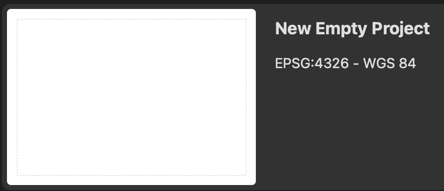
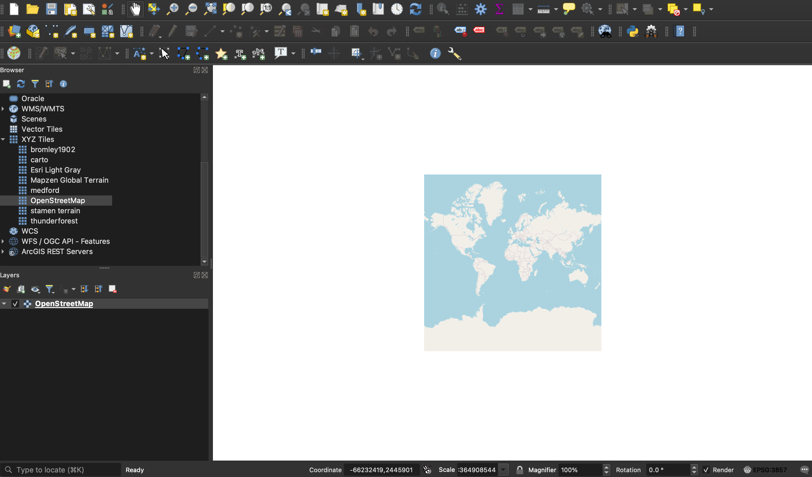
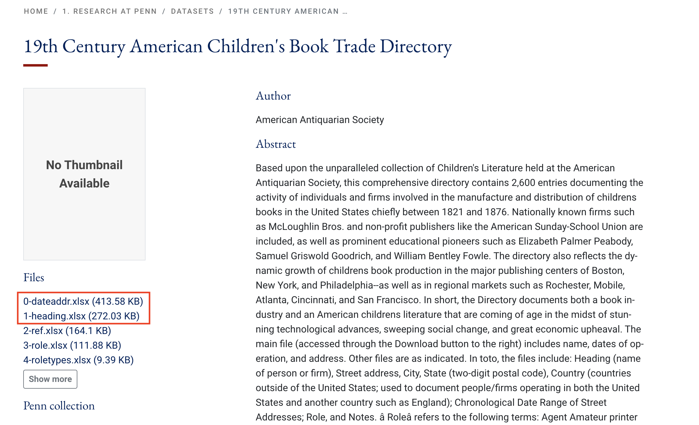
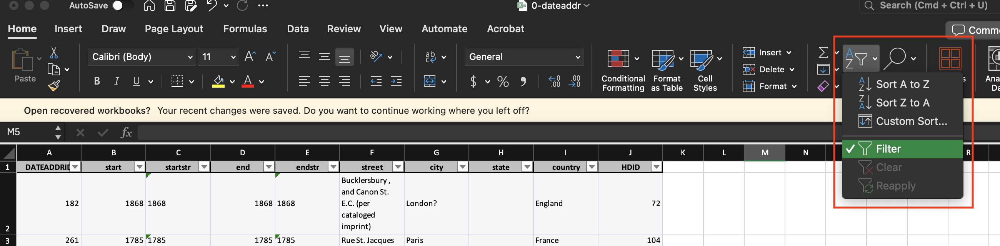
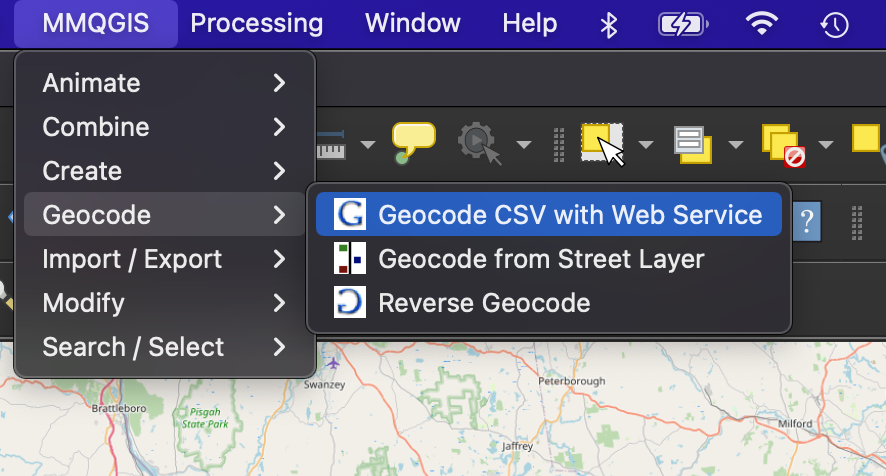

# Activity 04: NLP for GIS <!-- omit in toc -->

|  |
| :------------------------------------------------------------------------------------------------------------: |
| *"Three children engrossed by books," from the [Boston Public Library Arts Department](https://www.digitalcommonwealth.org/search/commonwealth:02872090f)* |

# Table of contents <!-- omit in toc -->

- [Introduction and context](#introduction-and-context)
- [Set up your workspace](#set-up-your-workspace)
  - [Directory stuff](#directory-stuff)
  - [Open QGIS!](#open-qgis)
- [Getting the data ready](#getting-the-data-ready)
  - [Download the data](#download-the-data)
  - [Pre-processing](#pre-processing)
- [Geocoding children's book publishers](#geocoding-childrens-book-publishers)
  - [OpenStreetMap, Nominatim, and MMQGIS](#openstreetmap-nominatim-and-mmqgis)
  - [Running the geocoder](#running-the-geocoder)
- [Natural language processing "by hand"](#natural-language-processing-by-hand)
- [Limits to NLP](#limits-to-nlp)

# Introduction and context

In this activity, you'll **geocode** historical address data. In this case, you'll work with data from the 19th century American children's book trade directory. The directory contains 2,600 entries documenting the activity of individuals and firms involved in the manufacture and distribution of childrens books in the United States chiefly between 1821 and 1876. It's [searchable online](https://www.americanantiquarian.org/btdirectory.htm), and—more importantly for us—you can [download the data](https://repository.upenn.edu/entities/dataset/16705c2f-023b-495e-baf4-dee805eae59f) from the University of Pennsylvania's Scholarly Commons.

The major difference between this activity and previous ones is that you'll be using a different geographic information system: QGIS!

[QGIS](https://www.qgis.org/en/site/) is a powerful, free, and open-source GIS software. You can do lots of the things in QGIS that you can do in ArcGIS Pro, including sophistiated vector and raster visualization/analysis.

QGIS is available on the Data Lab computers. Part of this activity will involve teaching yourself how to use it—now that you know your way around ArcGIS Pro, the learning curve for this will be less steep.

> ![imp]
>
> If you're unsure how to do something in QGIS—for example, adding vector data—your first step should be to just Google it (e.g., `qgis load vector data`). We also have a guide from the Leventhal Center on [getting started with QGIS](https://cartinal.leventhalmap.org/guides/get-started-qgis/), which may come in handy. There are also a *ton* of resources on [getting started with QGIS from Tufts](https://sites.tufts.edu/gis/quantum-gis-qgis-tutorials-tip-sheets/).

# Set up your workspace

## Directory stuff

No need to give you a ton of details at this point. You know what works for you. Set up a workspace for this activity!

## Open QGIS!

Open QGIS by typing "QGIS" into the search bar at the bottom left-hand side of the screen. Click the application when it appears.

When it opens, you'll be invited to start a "New empty project." Go ahead and double-click it:

Once you're in QGIS, the interface should look fairly familiar. Here are the main components:

In the **Browser panel**, double-click "XYZ tiles" and then double-click "OpenStreetMap". This should add an OpenStreetMap base map layer to your **map canvas**, and a layer will appear in the **layers list** underneath the browser panel:

Now that you've got a working project, **save the file in your workspace** before moving on to the next step.

# Getting the data ready

## Download the data

Get the data of the 19th century American children's book trade directory from the University of Pennsylvania Scholarly Commons: <https://repository.upenn.edu/entities/dataset/16705c2f-023b-495e-baf4-dee805eae59f>

You should download both `0-dateaddr.xlsx` and `1-heading.xlsx`.

Take a beat to open the data in Microsoft Excel. Consider: which one of these files would you want to geocode?

## Pre-processing

Perhaps obviously, we're going to geocode the `0-dateaddr.xlsx` file, because it contains well-structured address data.

Before you geocode this data, it needs a little bit of pre-processing.

There are thousands of records in this spreadsheet. It'll take *forever* to geocode, so let's focus on a smaller geography, like the state of Massachusetts.

1. In Microsoft Excel, open the `0-dateaddr.xlsx` file
2. In the "Home" tab, click "Filter"—you should see drop-down arrows appear next to all the fields

   

3. Click on the drop-down arrow by the `state` field ➡️ uncheck "Select All" ➡️ scroll down to "MA" and check it
4. Open a new spreadsheet and save it as `directoryAddresses_MA`. **Make sure to save it as a `.csv`!**
5. In `0-dateaddr.xlsx`
   1. select all the data with `ctrl+A` or another selection method of your choosing 
   2. copy all the data with `ctrl+C` or right-click ➡️ "Copy"
6. In `directoryAddresses_MA.csv`, click on the cell in the most upper left part of the spreadsheet and paste the data with `ctrl+V` or right-click ➡️ "Paste"

Now we have a spreadsheet with only data for Massachusetts—a little more manageable for this activity.

# Geocoding children's book publishers

As we discussed in class, **geocoding**—the process of turning descriptive address information into spatial data—requires at least two points of reference:

1. A topologically sound network of vector data that ideally includes things like parcel boundaries, streets, and even buildings
2. Descriptive information associated with that topological network, e.g., a gazetteer

Thanks to OpenStreetMap, Nominatim, and MMQGIS, we have all of these things built into QGIS for free. That's why we're using this instead of ArcGIS Pro: in order to geocode addresses in ArcGIS Pro, we need to pay for it. I don't want to spend thousands of our [limited ArcGIS Online credits](https://www.esri.com/en-us/arcgis/products/credits/overview) on a learning exercise, so we're making lemons out of lemonade and also learning a new software while we geocode for free instead.

## OpenStreetMap, Nominatim, and MMQGIS

You already know what OpenStreetMap (OSM) is from the parking lot cemetery assignment: it's a free and open-source base map, the "Wikipedia of maps," because anybody can edit it. This serves as our topologically sound network of vector data as well as our descriptive information or gazetteer.

[Nominatim](https://nominatim.org/) is a free and open-source tool for geocoding with OSM data. You could geocode with Nominatim in ArcGIS Pro, but it requires writing bespoke code into the Python console.

[MMQGIS](https://plugins.qgis.org/plugins/mmqgis/) is a QGIS plugin for manipulating vector map layers in Quantum GIS: CSV input/output/join, geocoding, geometry conversion, buffering, hub analysis, simplification, column modification, and simple animation. It comes installed with QGIS in all the Data Lab computers, but if you don't see it in the toolbar at the top of your screen, it's really easy to install (`Plugins` ➡️ `Manage and install plugins` ➡️ search for `mmqgis`, click it, and click "Install").  

## Running the geocoder

To geocode the data, navigate to the menu bar at the top of the screen and click "MMQGIS" ➡️ "Geocode" ➡️ "Geocode CSV with Web Service." MMQGIS should appear on the upper right-hand side.

In the geocoding dialog that opens, enter the parameters as such:

1. 

# Natural language processing "by hand"

We're not actually going to do any computational natural language processing (NLP) in this class, but if you think about it, geocoding is itself a kind of NLP: we're taking descriptive address data, "tokenizing" it into discrete parts, and passing that through an algorithm that can recognize those parts and assign them to places in the real world.

To wrap up this activity, I want you to do some natural language processing of your own.

Once you've successfully geocoded your addresses, open that `publishers-not-found.csv` file. All of these addresses were—you guessed it—not found when the geocoding tool queried them against the OpenStreetMap network.

There are two likely reasons why this happened:
1. The address for that record, being historical, doesn't exist anymore
2. 

To figure out why this happened, follow this procedure:

1. Scan through the 

# Limits to NLP

<!-------------------------------------[ Links ]
---------------------------------------->

[data]: https://canvas.tufts.edu/courses/54475/files/7090292/download?download_frd=1

<!---------------------------------[ Buttons ]--------------------------------->

[imp]: https://img.shields.io/badge/IMPORTANT!-red?style=plastic
[q]: https://img.shields.io/badge/Question-blue?style=plastic
[qs]: https://img.shields.io/badge/All_Questions-blue?style=plastic
[down]: https://img.shields.io/badge/Download_the_data-blue?style=for-the-badge
