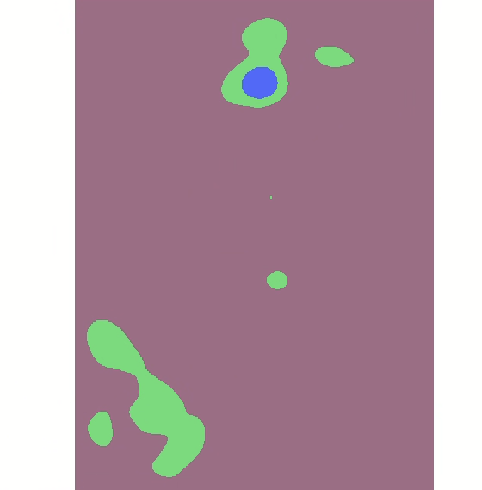

# Lab 05: Mesoamerican archaeology and spatial analysis  <!-- omit in toc -->

> *The tutorial was written by Ian Spangler on April 1, 2024 for ArcGIS Pro 3.1.4. Some parts were adapted from this tutorial on [spatial analysis in archaeology](https://www.geos.ed.ac.uk/~gisteac/pgis_arch/prwxacticals/pgis_arch_prac3.pdf).*

|  |
| :----------------------------: |
| *[Macchu Picchu](https://www.digitalcommonwealth.org/search/commonwealth:s4657c014), photographed by Ellen F. O'Connor in 1929.* |

## What you should submit <!-- omit in toc -->

During this lab, you'll test a variety of **spatial statistical tools** including:

* Spatial hypotheses
* Nearest neighbor index
* Clustering
* p- and z-values
* Kernel density
* Raster to polygon conversion
* Hot spot analysis
* Spatial autocorrelation

These tools help you move from basic "where" questions to analytical "why" questions.

Before **11:59pm on Tuesday, April 9**, submit to Canvas:

* Answers to the questions labeled with ![q] and summarized at the end of this lab, in a `doc` or `pdf` format 

## Table of contents <!-- omit in toc -->

- [Introduction and context](#introduction-and-context)
- [Set up your workspace](#set-up-your-workspace)
- [Download and prepare the data](#download-and-prepare-the-data)
- [A null hypothesis](#a-null-hypothesis)
- [Nearest neighbor index](#nearest-neighbor-index)
- [Looking at subareas](#looking-at-subareas)
- [Finding magnitude with kernel density](#finding-magnitude-with-kernel-density)
- [Other clustering techniques](#other-clustering-techniques)
- [Identifying hot and cold spots](#identifying-hot-and-cold-spots)
  - [Adding elevation to the mix](#adding-elevation-to-the-mix)
  - [Creating a field for elevation in your `sites` layer](#creating-a-field-for-elevation-in-your-sites-layer)
  - [Test a hot spot analysis on `sites_elevation`](#test-a-hot-spot-analysis-on-sites_elevation)
  - [Adding population into the mix](#adding-population-into-the-mix)
- [Reflection](#reflection)
- [Submit](#submit)

## Introduction and context

In 1983, under the supervision of archaeologist [Anabel Ford](https://en.wikipedia.org/wiki/Anabel_Ford), the ancient Mayan city of El Pilar was discovered on the border of Belize and Guatemala. Eventually, the El Pilar Project led to an extensive survey of archaeological sites across Mexico, Guatemala, Belize, Honduras, and El Salvador.

Using tools from the ArcGIS Pro Spatial Analyst toolbox, you'll assess

## Set up your workspace

Again, no need to belabor this. Set up your workspace in a way that makes sense for you. At minimum I recommend including at least a `data` folder where you can store all your source data.

Before proceeding to the next section, create a new ArcGIS Pro project and save it somewhere sensible in your workspace.

## Download and prepare the data

Copy the data from the `S: Drive` into your `H: Drive`.

Unzip it and load it into your new ArcGIS Pro project. You should see something like:

It's quite a long Rename the layer to `sites`.

Take a moment to inspect the data. Open its attribute table and scroll around. From looking at the field names, can you tell what information is represented here?

Now open the `sites` layer's properties. Navigate to the "Source" tab, and unfold the "Spatial Reference."

| ![q] |
| :--- |
| 1. What is the geographic coordinate system of your `sites` layer? |

Our first step should ***always*** be to check whether the data is projected. Since in this case, it is not, we need to project it.

Let's project the data to **Mexico ITRF2008 UTM Zone 16N_1**:

1. In the **Analysis** tab, click "Tools"
2. "Data Management Tools" ➡️ "Projections and Transformations" ➡️ "Project"
3. Set the parameters system like so:
   1. Input = `sites`
   2. Output = name the file `sites_projected`
   3. Output Coordinate System = `Mexico ITRF2008 UTM Zone 16N_1`

Once you've projected the data, remove `sites` so that only `sites_projected` remains.

## A null hypothesis

Now that we have our data plotted on the map, we can start to dig into analyzing its distribution. What kinds of spatial patterns emerge? And what can we learn about ancient cultures and people from them?

It's always wise to begin from a hypothesis. In our case, the **null hypothesis**—or the assumed hypothesis that we'll try to disprove—is always going to be that the spatial data in question is dispersed randomly.

In our specific case, the null hypothesis could be stated that "Archaeological sites in the study area display random distribution." Just eyeballing the sites—and based on what we know about how humans settle—it seems likely that the null hypothesis is wrong.

But how can we *analytically confirm* this observation?

## Nearest neighbor index

The **[Nearest Neighbor Index](https://pro.arcgis.com/en/pro-app/latest/tool-reference/spatial-statistics/h-how-average-nearest-neighbor-distance-spatial-st.htm)** (NNI) measures the distance between each feature centroid and its nearest neighbor's centroid location. It then averages all these nearest neighbor distances. If the average distance is less than the average for a hypothetical random distribution, the distribution of the features being analyzed is considered clustered.

In the "Analysis" tab, click "Tools" (ensure "Toolboxes" is selected underneath the search bar). Then "Spatial Statistics" ➡️ "Analyzing Patterns" ➡️ "Average Nearest Neighbor." Set the parameters like so:

1. Input feature = `sites_projected`
2. Distance method = `Euclidean`
3. Check "Generate Report"
4. Click "Run"

When the tool finishes running, click "View Details" and then click the link for the report file.

You should see an `html` page open up:

The **Observed mean distance** is calculated from the `sites_projected` data, while the **Expected mean distance** is what would be expected for our null hypothesis, or a truly random distribution of points. If the index, or **average nearest neighbor ratio**, is less than 1, the pattern exhibits clustering. If the index is greater than 1, the trend is toward dispersion.

You can also refer to the [**p-value** and **z-score**](https://pro.arcgis.com/en/pro-app/latest/tool-reference/spatial-statistics/what-is-a-z-score-what-is-a-p-value.htm) to assess whether the clustering seems random or not:
- Small p-values indicate a low probability that the observed spatial pattern is the result of random processes
- Z-scores are [standard deviations](https://pro.arcgis.com/en/pro-app/latest/help/analysis/geoprocessing/data-engineering/view-statistics.htm) (or measures of the spread of the distribution). If, for example, a tool returns a z-score of +2.5, you would say that the result is 2.5 standard deviations

Both z-scores and p-values are associated with the standard normal distribution as shown below:

Based on the report we got from the NNI, it seems mathematically unlikely that the clustering in our data was the result of random chance. Take a moment to look through the results more carefully. 

| ![q] |
| :--- |
| 2. Paste the values for the average nearest neighbor summary. |

> ![imp]
>
> NNI measures relationships exclusively based on distance. A slightly more detailed way to determine clustering would be to test for spatial autocorrelation, or the degree to which a feature is correlated with itself based on certain attributes. Following Waldo Tobler's first law of geography, the [spatial autocorrelation](https://pro.arcgis.com/en/pro-app/latest/tool-reference/spatial-statistics/h-how-spatial-autocorrelation-moran-s-i-spatial-st.htm) tool—also known as Global Moran's I—measures spatial autocorrelation based simultaneously on location and feature values.

## Looking at subareas

This archaeological data spans multiple countries. What would happen if we analyzed it at the scale of national boundaries, instead of the actual corpus of archaeological sites? Let's try that out by chaining together a series of selection queries.

Head over to [Natural Earth](https://www.naturalearthdata.com/downloads/10m-cultural-vectors/10m-admin-0-countries/) and download the **Admin 0 – Countries** data.

Using the same workflow as you used for the sites, **project** the data and rename it `countries_projected`. Remove the original countries layer so that the only layers in your map are `sites_projected` and `countries_projected`.

> ![imp]
>
> At this point in the tutorial, I turned off the standard ArcGIS Pro base map layers. Doesn't make a difference if you do that or not, but just be aware because it will affect how my screenshots look compared to yours.

First, while the "Select" tool in the **Map** tab is activated, click on Mexico. A blue line should appear around it indicated that it's selected.

Now, in the **Map** tab, click the "Select by Location" tool. Build the following query:

The output should resemble:

Now only the points that fall within the country boundary of Mexico are selected. **Go ahead and re-run the NNI tool, taking care to ensure only those selected points are included in the analysis, as in the screenshot below.** 

Check the `html` report again. Make note of the **Nearest neighbor ratio**, the **p-value**, and the **z-score**.

Now, repeat this process for both Guatemala and Belize.

| ![q] |
| :--- |
|  3. Compare the nearest neighbor ratios, p-values, and z-scores for Mexico, Guatemala, and Belize. What were some of the major differences between those values for each country? What do you think was the cause of the difference? |
|  4. Why wouldn't using modern country boundaries as subareas for this data make much sense in an analysis? What's another kind of data that you might be able to use as a subarea to evaluate the NNI? |

## Finding magnitude with kernel density

We've determined that it's unlikely that clustering in any case here is random, but what if we tried to actually identify areas of especially pronounced clusetering?

The **Kernel Density** tool can be useful for this. As we've seen before, [kernel density](https://pro.arcgis.com/en/pro-app/latest/tool-reference/spatial-analyst/kernel-density.htm) calculates a magnitude-per-unit area from point or polyline features using a kernel function to fit a smoothly tapered surface to each point or polyline.

Search for "kernel density" in the **geoprocessing** pane and enter the parameters like so:
1. Input points = `sites_projected`
2. Population field = `NONE`
3. Output raster = `sites_kd2000`
4. Output cell size = let's try `2000`
5. Area units = `square kilometers`
6. Output cell values = `densities`
7. Method = `planar`

Click "Run" and you should see something like this (you might have to move it above your `countries_projected` layer and turn off the `sites_projected` layer to really see it):

Nice! It's a little blocky, though—let's run it one more time with cell sizes of `1000` instead of `2000`.

This time, the output should resemble:

That feels slightly better. Now we can see a rough estimate of magnitude.

In the **Symbology** pane for this layer, change the number of classes to `5`. What do you notice? Now change it to `3`.

Let's turn this raster layer into a polygon so that we can overlay only the highest magnitude zones.

1. First, we'll need to **Reclassify** it, becaue we can only convert a raster layer to a polygon layer if the raster layer is of `integer` type.
2. In the **Geoprocessing** pane, search "reclassify" and click on the "Spatial Analyst" tool. You can leave the default values, which should be classified into 3 buckets like so:

    

3. Once you've renamed the output layer to `kd_reclassify`, go ahead and click "Run." You should see something like this:

    

4. Now that we have a raster layer of integer value, you can convert it to a polygon. In the **Geoprocessing** pane, search "raster to polygon." Click on the "Conversion" tool and enter the following parameters:
   1. Input raster = `kd_reclassify`
   2. Field = `Value`
   3. Output polygon features = `focus_areas`
   4. Check "Simplify polygons"
5. The output should resemble:

    

Since we're only interested in areas of *high clustering*, you can delete the record of `0` value from the `focus_areas` file. You can also delete the tiny point. Go ahead and **Symbolize** the data categorically by the `Id` field. This should leave you with a vector polygon layer containing 6 records that resembles the following:

We could use this kind of layer for all sorts of secondary analysis; for example, what if you wanted to argue for the protection of certain "conservation zones" based on archaeological sites? Turning a continuous surface of points into discretely bounded polygon entities can be a powerful way to make an argument.

## Other clustering techniques

Of course, kernel density is not the only way to represent clusters.

Turn on your `sites_projected` layer, and while the layer is selected in the **Contents** pane, click the "Feature Layer" tab at the top of the screen. You should see a button for "Aggregation." Click it, and click "Clustering."

Zoom in and zoom out. What do you notice about how the clusters change?

Now try setting the aggregation type to "Binning." 

| ![q] |
| :--- |
| 5. Compare the three methods of clustering you've tested so far: kernel density, clustering aggregation, and binning aggregation. What patterns does each method reveal and what patterns does each method obscure/fail to highlight? |

Once you've finished comparing the different clustering techniques, turn "Aggregation" off by setting the aggregation type to "None."

## Identifying hot and cold spots

**[Hot spot analysis](https://pro.arcgis.com/en/pro-app/latest/tool-reference/spatial-statistics/hot-spot-analysis.htm)** is another kind of clustering analysis that identifies "hot" and "cold" spots—or statistically significantly clustered areas of high and low values—based on an input vector dataset.

In order to conduct a hot spot analysis, you need a secondary attribute. The kernel density shows us simple magnitude, but a hot spot analysis will show us the presence or absence of statistically significant qualitative clusters based on some other criteria.

One problem with our `sites_projected` layer is that we don't have a useful quality in our attribute table right now. So let's create one.

### Adding elevation to the mix

While modern countries might not be the most sensible thing to compare alongside this ancient data, comparing the distribution of archaeological sites against different *elevations* could be more interesting. For example, do archaeological sites tend to cluster differently depending on their altitude? To find this out, let's introduce a **digital elevation model** (DEM) into the mix.

I downloaded and pre-processed the data that you'll use from [EarthExplorer](https://earthexplorer.usgs.gov/), a free website from USGS through which you can get all sorts of remotely sensed data.

Some of you may want DEMs for your final projects. [This video](https://www.youtube.com/watch?v=f3ajsZ3QEGM) is short and clear about the process of downloading them. If you need to download a bunch of DEMs – I think I downloaded around 40 for this lab – you should try to use the "bulk download" tool. It isn't the clearest interface so email me if you have trouble with it.

> ![imp]
>
> You might be getting to a point in the semester where your `H: Drive` is running low on space. You're about to load a large file into your `H: Drive`, so just take care to make sure you have enough space.

From the `S: Drive`, copy the file `dem_projected` into your workspace and add it to your map. You should see something like this:

Let's get this looking a little better. Click on the `dem_projected` layer in the **Contents** pane, then click the "Raster Layer" tab in the banner. Set the "Resampling Type" to `Bilinear`, the "Stretch Type" to `Percent Clip`, and stretch the data along a color ramp that works for you. I chose this one:

Now open the attribute table for `dem_projected`. Scroll through to get a sense of what it contains.

| ![q] |
| :-- |
| 6. If the `VALUE` field refers to elevation in meters, what do the values in the `COUNT` field refer to? |

### Creating a field for elevation in your `sites` layer

Let's create a field for elevation in our `sites` layer by using the **[Extract Values to Points](https://pro.arcgis.com/en/pro-app/latest/tool-reference/spatial-analyst/extract-values-to-points.htm)** tool. This tool extracts the cell value of a raster based on a set of point features and records the values in the attribute table of an output feature class.

Search for "Extract values to points" in the **Geoprocessing** pane and set your parameters to:
1. Input point features = `sites_projected`
2. Input raster = `dem_projected`
3. Output point features = `sites_elevation`

Click "Run" and the new layer should appear in your contents pane.

| ![q]                                                              |
| :---------------------------------------------------------------- |
| 7. What is the highest `RASTERVALU` in your output feature class? |
| 8. Why did some records get processed with a `<NULL>` value? Was it the same reason for all `<NULL>` values? |

### Test a hot spot analysis on `sites_elevation`

Now that we have a `sites` layer with elevation values in the attribute table, we can run a hot spot analysis. Search for "hot spot analysis" in the **Geoprocessing** pane and select the tool "Hot Spot Analysis (Getis-Ord Gi*)". Set the parameters to the following:

1. Input feature class = `sites_elevation`—**Make sure your selection is cleared, the input should not have a selection**
2. Input field = `RASTERVALU`
3. Output feature class = `elevation_hotspots`
4. Conceptualization of spatial relationships = Leave it as `Fixed distance band` for now
5. Distance method = `Euclidean`

Click "Run" and examine the output. You should see something like this: 

| ![q]                                                              |
| :---------------------------------------------------------------- |
| 9. What is the `Gi_Bin Fixed` value of the points categorized as "Not Significant?" How is that value being computed and why is it not considered statistically significant? You can reference ArcGIS Pro's description of [hot spot analysis](https://pro.arcgis.com/en/pro-app/latest/tool-reference/spatial-statistics/hot-spot-analysis.htm) to answer this. |

### Adding population into the mix

The results of the hot spot analysis for elevation should not be surprising at all. Low elevation values (e.g., "cold" spots) appear clustered with a high degree of confidence, while high elevation values (e.g., "hot" spots) appear clustered with a high degree of confidence. What we're seeing is basically a confirmation that the tools works as expected.

Here's a potentially more interesting question: throughout our Central American study area, how do archaeological sites cluster relative to *modern human settlement*? e.g., will we find that areas inhabited thousands of years ago tend to continue being inhabited today, or vice versa, or some mix of in-between?

From the `S: Drive`, copy the zipped data `gpw-v4-population-density-rev11_2020_2pt5_min_tif` to your workspace. Unzip it and add the TIF to your map. You should see the following:

This data is from NASA's [SEDAC](https://sedac.ciesin.columbia.edu/data/set/gpw-v4-population-density-rev11) (Socioeconomic Data and Applications Center). It's a global estimate of population density at a **2.5 arc-minute resolution**. One degree on the globe is composed of 60 arc-minutes. For comparison, our DEM data was downloaded at 1 arc-minute (about `30` meter) resolution. You can download SEDAC population estimates at various scales and temporalities; this one is 2.5 arc-minutes for the year 2020.

Rename the SEDAC data to `population` before proceeding.

Let's run that **Extract Points by Value** tool again to attach population value to our points. Your parameters should be set as:

1. Input point features = `sites_projected`
2. Input raster = `population`
3. Output point features = `sites_population`

Leave both boxes unchecked and run the tool. Once it's run, open the attribute table and look around.

| ![q]                                                     |
| :------------------------------------------------------- |
| 10. What does the `RASTERVALU` field refer to?            |
| 11. What is the highest value in the `RASTERVALU` field? |
| 12. Why did some values get computed as `<NULL>`? (You might need to check one of your base maps to determine this.)        |

Now let's run the **Hot Spot Analysis (Getis-Ord Gi*)** once again, but this time for the `sites_population` layer:

1. Input feature class = `sites_population`—**make sure no records are selected**
2. Input field = `RASTERVALU`
3. Output feature class = `population_hotspots`

Leave the rest of the fields as they are and click "Run." I flicked my `World Topographic Map` and `Hillshade` base layers back on and the result looks like this:

Wow: a very different landscape of statistical significance this time. Since we weren't just correlating elevation values—which we'd expect to cluster along areas of statistical significance—the `population_hotspots` actually reveal some interesting patterns.

To conclude this lab, take a moment to compare and contrast a few different hot and cold clusters.

| ![q] |
| :--- |
| 13. Compare one 99% confidence "hot" cluster against one 99% confidence "cold" cluster. In 2-3 sentences, describe the two areas: what sorts of natural and human featutres are in the "hot" cluster versus the "cold" cluster? Why were they assigned the values that they got? |
| 14. Now compare one 90% confidence "hot" cluster against one 90% "cold" cluster. Again in 2-3 sentences, make the same comparisons, identifying what kinds of natural/human features as well as your guess as to why they were clustered in this fashion. |
| 15. Before you submit your assignment, take a screenshot of the ArcGIS Pro interface showing your final hot spot analysis that combines archaeological sites and modern population data. |

## Reflection

In this lab you have touched a lot of different tools, just to get a sense of how they work and the basic ideas behind how they function. However, to perform a rigorous analysis—one that would pass muster in scientific peer review, for example—you'd want to do some extra due diligence. You might consider:

* Re-running the hot spot analysis a few times with different parameters, e.g., testing different kinds of spatial relationships
* Using tools like [Global Moran's I](https://pro.arcgis.com/en/pro-app/latest/tool-reference/spatial-statistics/spatial-autocorrelation.htm) to determine a distance threshold for your hot spot analysis
* Incorporating other environmental features that would affect clustering, like slope and water bodies, into your analysis

Those are just three of many additional directions such a project could take.

## Submit

Before **11:59pm on Tuesday, April 9**, submit to Canvas:

* Answers to the questions labeled with ![q] and summarized below, in a `doc` or `pdf` format

<!-------------------------------------[ Links ]
---------------------------------------->

[l]: #

<!---------------------------------[ Buttons ]--------------------------------->

[imp]: https://img.shields.io/badge/IMPORTANT!-red?style=plastic
[q]: https://img.shields.io/badge/Question-blue?style=plastic