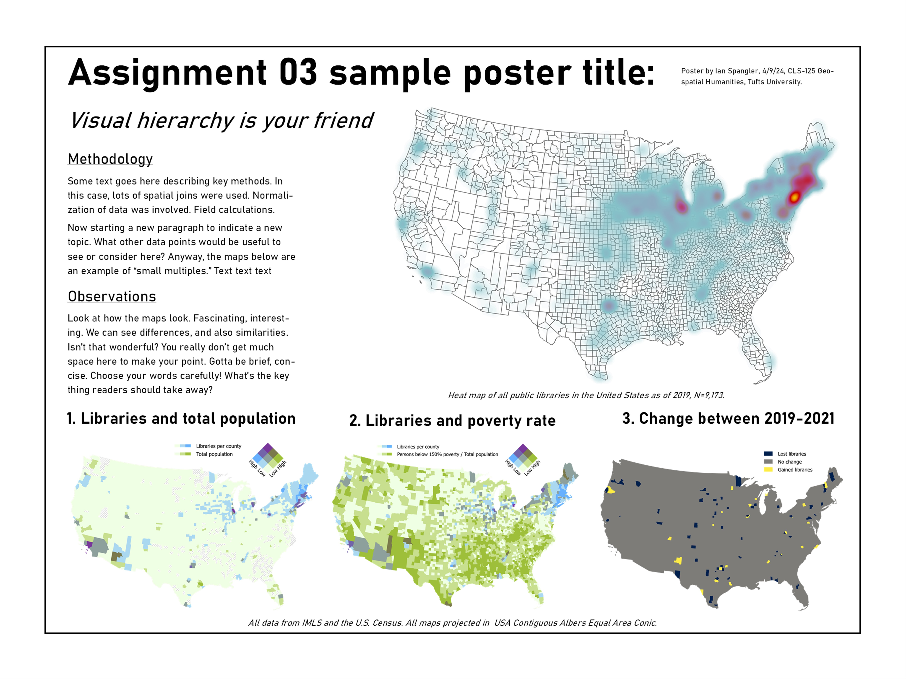
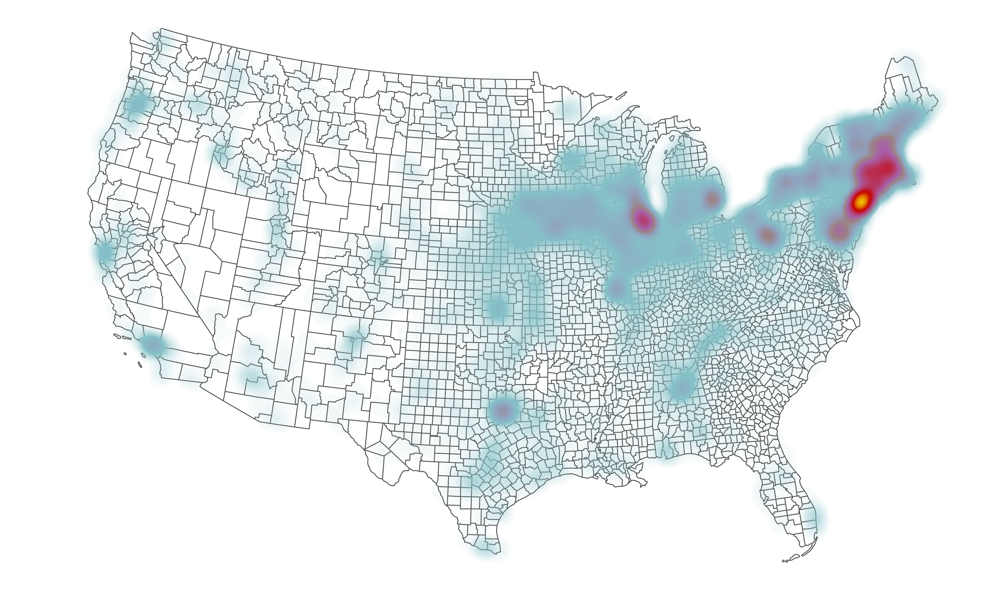
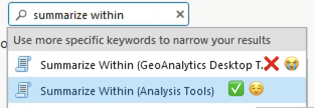
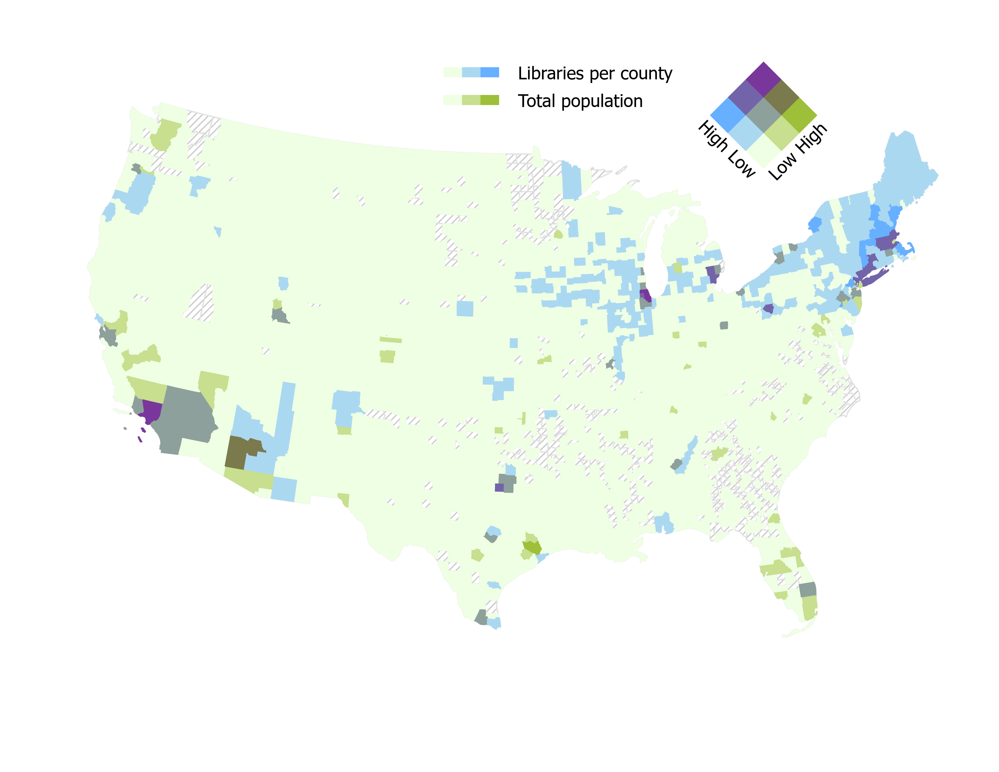
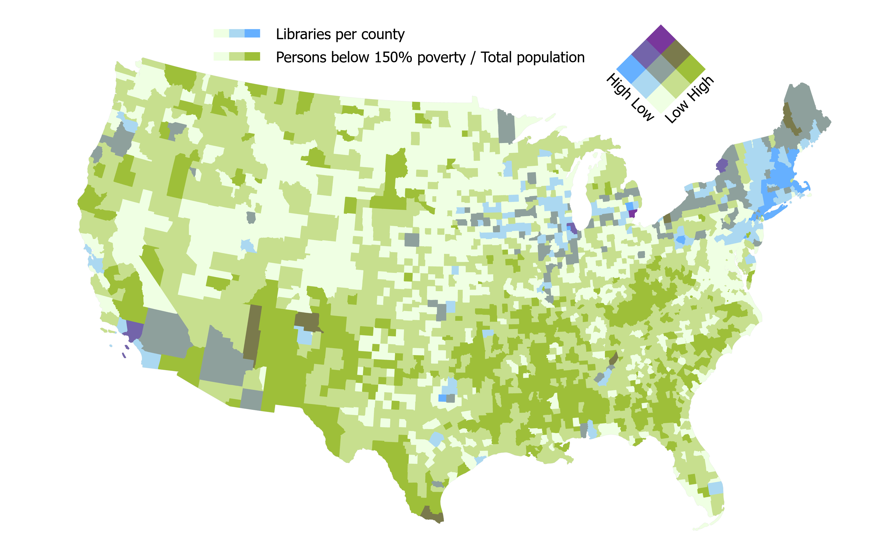
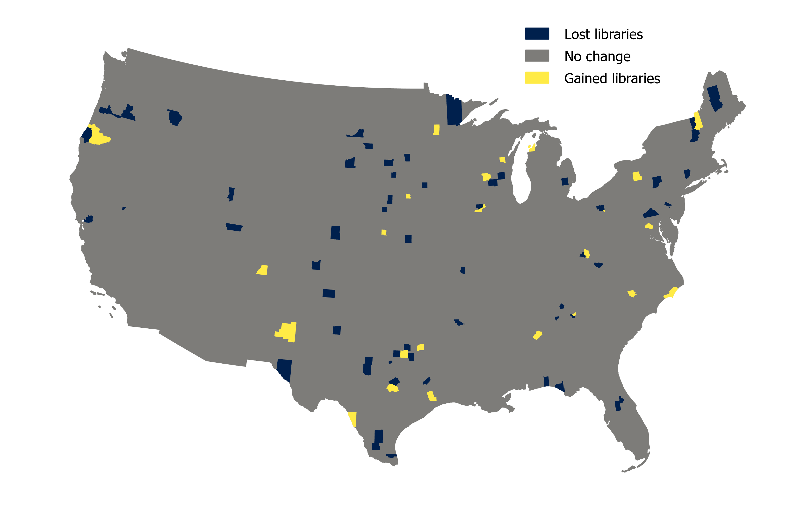

# Assignment 03: Libraries & layouts <!-- omit in toc -->

|  |
| :----------------------------: |
| *[Boston Public Library, June 1928](https://www.digitalcommonwealth.org/search/commonwealth:c821gx85k)* |

## What you should submit <!-- omit in toc -->

By Tuesday, 4/16 at 11:59pm, you should submit a **15"x20" poster** (or 20"x15") in `jpeg` format created using Microsoft Publisher. The poster should include the following:

- 1 heat map showing 2019 public libraries in the U.S.
- 3 "small multiple" choropleth maps, each including a title and legend:
  - 1 bivariate map showing public libraries and U.S. county population
  - 1 bivariate map showing public libraries and one variable of your choice from the social vulnerability index (SVI) dataset
  - 1 graduated color map showing the increase/decrease by U.S. county of public libraries between 2019 and 2021
- 2 sections of written text:
  - 50-100 words summarizing your methods
  - 50-100 words describing your observations

## Table of contents <!-- omit in toc -->

- [Introduction and context](#introduction-and-context)
- [Set up a workspace](#set-up-a-workspace)
- [Download the data](#download-the-data)
- [Making four maps](#making-four-maps)
  - [Heat map](#heat-map)
  - [Bivariate map with libraries and population in 2019](#bivariate-map-with-libraries-and-population-in-2019)
  - [Join SVI data](#join-svi-data)
  - [Libraries lost and gained, 2019-2021](#libraries-lost-and-gained-2019-2021)
- [Making your poster](#making-your-poster)
- [Submit](#submit)

## Introduction and context

Libraries are a public good that we encounter in one way or another almost every day, but what is their geography? What kinds of spatial relationships do libraries have to other demographic variables like population or income, and how can we use spatial reasoning visualize those relationships?

In this assignment, you'll answer this question using two datasets:

1. Every year since 2006, the [Institute of Museum and Library Services](https://www.imls.gov/) (IMLS) collects a [**public libraries survey**](https://www.imls.gov/research-evaluation/data-collection/public-libraries-survey) which attempts to "provide information that policymakers and practitioners can use to make informed decisions about the support and strategic management of libraries." They have made this data available for free to the public. In addition to containing off-the-shelf spatial data in the form of latitudes and longitudes, this spreadsheet also contains tons of other useful information.
2. The Center for Disease Control (CDC), in collaboration with a bunch of other federal agencies, has created a **[social vulnerability index (SVI)](https://www.atsdr.cdc.gov/placeandhealth/svi/documentation/SVI_documentation_2020.html)** in order "to help public health officials and emergency response planners identify and map the communities that will most likely need support before, during, and after a hazardous event." The index breaks down into [four main categories](https://www.atsdr.cdc.gov/placeandhealth/svi/documentation/pdf/SVI2020Documentation_08.05.22.pdf): *socioeconomic status*, *household characteristics*, *racial & ethnic minority status*, and *housing & transportation type*. Each of these categories contains 4-5 demographic variables.

Between the IMLS and CDC data, there are tons of data points we could dig into here. When you need to communicate lots of information 

Like [last week's lab](../../11_analysis-iii/lab/archaeology.md), this assignment does not dive deeply into spatial analysis (e.g., geostatistics, regression). Rather, the goal is for you to continue sharpening established skills—such as field calculation, attribute/location querying, and thoughtful symbolization—while dipping your toes into the not-insignificant challenge of designing a small poster. **This is also a chance for you to get started with Microsoft Publisher, which is overall pretty easy to use, but is still good to encounter before the first time you need to make your final project poster.** Instructions on using Microsoft Publisher are [posted to Canvas](https://canvas.tufts.edu/courses/54475/pages/using-microsoft-publisher?module_item_id=1342389) and I'll link them again down below.

Your submission, a poster in `jpeg` format, should resemble this sample poster below (this is **not** meant to be a perfect poster—you probably see some things in it that you'd do differently, and you should!):

## Set up a workspace

You know the drill! And it's **very important to set up a workspace this time** because you'll be working with lots of data.

Since you'll be dealing with more than a few temporary image files (e.g., `jpeg`) for the poster in this assignment, I recommend including a directory called `poster` or something to that effect:

    week12/
    ├─ assignment03/
        ├─ data/
        ├─ workspace/
        ├─ poster/

## Download the data

Data for this assignment is located in 3 places:
1. [IMLS](https://canvas.tufts.edu/courses/54475/assignments/400921)—I did some minor pre-processing and posted two datasets to Canvas
   1. [Metadata](https://www.imls.gov/sites/default/files/2023-06/2021_pls_data_file_documentation.pdf)
2. [CDC SVI data](https://www.atsdr.cdc.gov/placeandhealth/svi/data_documentation_download.html)—be sure to download 2020 data for all counties
   1. [Metadata](https://www.atsdr.cdc.gov/placeandhealth/svi/documentation/pdf/SVI2020Documentation_08.05.22.pdf)
3. [U.S. County Boundaries](https://www.census.gov/geographies/mapping-files/time-series/geo/carto-boundary-file.html) from Census.gov

Download all 3 datasets and put them in your workspace, then create an ArcGIS Pro project. **Set the map's projection to `USA Contiguous Albers Equal Area Conic`.**

There will be four main components to this final poster: a heat map and 3 choropleth maps. The choropleth maps are commonly known as **small multiples**, a useful representational technique for showing different variables in the same spatial dataset.

Let's take a crack at each of these maps, one by one.

## Making four maps

### Heat map

Since you've already seen or used most of these tools before, I'm just going to be giving you instructions as broad brushstrokes. Starting with the heat map:

1. Load the `libraries_fy2019` shapefile and the counties data into your project
2. Project the counties data to `USA Contiguous Albers Equal Area Conic` and name the output `counties_proj`
3. In the **Symbology** pane, display the libraries as a heat map using a color ramp that makes sense to you
   1. If you want, you could test out the "Layer Blending" options in the **Feature Layer** tab—some of them look really nice with heat maps in particular
4. Style the underlying counties layer nicely
5. Open a layout from the **Insert** tab ("New Layout")
6. Make sure it looks okay
7. Export it to your `poster` directory from the **Export** tab ("Export Layout")

    > ![imp]
    >
    > When you export, pay attention to things like borders around the map layout that get created by default. I wanted to remove mine before export, which I did with **Map Frame** ➡️ Click the drop-down at the top-left and change to "Border" ➡️ Set stroke to transparent
    >
    > Also, after you've exported the map, don't fuss with the map layout anymore. You'll want this layout to remain exactly the same for the next 3 maps you make. It can be really hard to recreate the exact parameters (e.g., scale, zoom, orientation) of a map layout if you get rid of it, and the consistency among different maps is part of what makes small multiples a strong representational technique.

   1. You can export it as `jpeg` or `png`—it shouldn't make a difference. Name it `map1_libHeat`
   2. Feel free to check the "Clip graphics extent" and "Transparent background" buttons to see how they look

Your exported map should resemble:

Now that you have a map layout set up, and your first map exported, let's try visualizing something a little more complex than the basic heat map.

### Bivariate map with libraries and population in 2019

**Bivariate maps** are maps that show two variables instead of one. ArcGIS Pro makes it pretty easy to create these maps.

The first bivariate map you should make is one that shows libraries on one axis and total population on the other. Since our data doesn't inherently show this information, we'll use the **Summarize Within** tool to achieve it.

[Summarize Within](https://pro.arcgis.com/en/pro-app/3.1/tool-reference/analysis/summarize-within.htm) performs the same basic function as a [Spatial Join](https://pro.arcgis.com/en/pro-app/3.1/tool-reference/analysis/spatial-join.htm), but it gives you more control over how the attribute tables are combined and ultimately summarized.

> ![imp]
>
> **Summarize Within** is one of those tools that has the same name in multiple ArcGIS Pro packages. If you search it in the search bar, the first hit might be a "geoanalytics desktop tool":
>
> 
>
> In this case, both Summarize Within tools do basically the same thing, but they look a little different. In other cases, though, if you aren't careful which tool you're selecting, you could run into all sorts of unexpected problems.

1. Before you get started, open the **Attribute Table** for `libraries_fy19` and pan around. What kinds of fields does it contain? [Use the metadata](https://www.imls.gov/sites/default/files/2023-06/2021_pls_data_file_documentation.pdf) to make sense of the field headers.

    There are lots of important fields here, but the one we'll pay attention to is `CNTYPOP`. You might be able to guess what this is just by the abbreviation, but you should confirm what it is by using the metadata.

2. **Summarize Within** where your input polygon is `counties_proj` and your input points are `libraries_fy19`
   1. Name your output feature class something that makes sense to you and which contains metadata about the input file, like `libraries19_summarize`
   2. You can leave "Keep all input polygons" checked
   3. In the "Summary Fields" options:
      1. Set "Field" to `CNTYPOP` and "Statistic" to `Mean`
      2. This is a sort of cheeky way to join the population statistic for each county from the points file to the counties file. Since population is summarized in the points file, we can get a two-for-one deal by averaging the value of that field. For each county, it will compute back to the raw total of population.
3. Once you've summarized your data, apply **Bivariate** symbology.
   1. Pick a color ramp other than the default
   2. Set "Field 1" to `Count of Points`
   3. Set "Field 2" to `CNTYPOP`
   4. Use a suitable classification method
   5. Use a 3x3 grid size
   6. Click the gear next to "Color scheme" and select "Apply to fill and outline"
4. In the "Legend" option at the bottom of the Symbology pane, change the name of the fields to represent the actual data being mapped—e.g., "Libraries per county" and "Total population by county"
5. Some of the counties will disappear because they have no data. You should find some way to cartographically handle this. I recommend duplicating the `counties_projected` layer and giving it some neutral styling, e.g., gray diagonal lines

When you're done, go back to your map layout, add a legend, and export. Save it as a `jpeg` or `png` and name it `map2_libTotPop`. Your map should resemble:

### Join SVI data

Your SVI data should be in `csv` format. Open it in Microsoft Excel and examine it.

What do you see? Use the [metadata guide](https://www.atsdr.cdc.gov/placeandhealth/svi/documentation/pdf/SVI2020Documentation_08.05.22.pdf) to determine what each field means. **You need to join this data to your `libraries19_summarize`** layer in order to map it. How will you do so? What field seems like a suitable "join" field, e.g., a field with a unique ID for each record in the spreadsheet?

Now, in your ArcGIS Pro project, open the attribute table of the `libraries19_summarize` layer. Compare the SVI data in the Excel spreadsheet to the attribute tble of `libraries19_summarize`. **Identify the common, joinable field.**

> ![imp]
> 
> Before you close the spreadsheet and move on to the next steps, save it as an `xls` file. For some reason, I've found that ArcGIS handles the leading zeroes in some columns better when they are saved as `xls` as opposed to `csv`.

1. Load your SVI data into ArcGIS Pro and join it to the `libraries19_summarize` layer. Once it's joined successfully (around 3,140 should go through), I recommend saving this layer as a new feature class, perhaps something like `libraries19_svi`
2. Scan through the data and decide what kind of map you want to make. You should make another bivariate map where the total count of libraries is represented on one axis, and one of the SVI variables is represented on another. Use the metadata to determine which variable you'd like to depict
3. **Whatever variable you choose, be sure to normalize it. If you need a refresher on how and when to normalize, see [here] or [here](https://www.axismaps.com/guide/standardizing-data)(https://www.pbcgis.com/normalize/) or [here](https://www.e-education.psu.edu/geog486/node/608).**
4. When you're done normalizing it, set the symbology to "bivariate" and create a map using the same color ramp that you chose for your first bivariate map.
5. In the layout tab, make sure you've made appropriate updates to the legend, then export as `png` or `jpeg`. I recommend saving this map as `map3_lib{{Variable}}`, for example, `map3_libPoverty`

The final should resemble (obviously the choropleth distribution will differ based on the variable you actually choose, your classification decisions, etc.):

### Libraries lost and gained, 2019-2021

Your final map should depict change over time. To accomplish this, you should:

1. Run the **Summarize Within** tool again on your `libraries19_svi` layer, but this time, load `libraries_fy21` into ArcGIS Pro and use that as the point input layer. All the other parameters should remain the same as when you ran it before. I recommend saving the output with a name like `libraries_change`

    > ![imp]
    > 
    > At this point, your attribute table is getting *enormous*. In many cases—and this is one of them—it's worth figuring out which fields want to work with *before* you join a tabular `xls` file to spatial data.
    > 
    > Also, note that the `Count of Points` fields were both exported with the same name, since they're the result of the same tool being run twice. It's hard to avoid this because **Summarize Within** automatically names that field `Count of Points`. You don't have to update the field names or aliases, although it might make the next couple steps a bit easier. Just be aware that this happened and be sure that when you're computing new data from these two fields, you're referencing the correct ones.

2. Create a new field of numeric data type in `libraries_change` and name it `change`
3. Using the **Field Calculator**, subtract the `Count of Points` field from your 2021 summary from the `Count of Points` field from your 2019 summary. In other words, something like:

        countOfPoints2021 - countOfPoints2019

    By subtracting the 2021 count from the 2019 count, we derive a value that tells us which counties gained or lost public libraries between 2019 and 2021.

4. In the **Symbology** pane, give your map a nice color ramp that fits the data. **Since the data has a midpoint (e.g., a zero value), what kind of color ramp—sequential or diverging—makes the most sense?** 
5. Classify the data in a sensible manner.

Your final map should resemble:

## Making your poster

Now that you have your 4 maps, you can lay them out using Microsoft Publisher. You could also do this entirely in ArcGIS Pro—you're free to try that out, if you want, but I think Publisher will be a little easier. It's really common for cartographers to prepare their maps and data in a GIS like Pro or QGIS before moving to a more design- or layout-oriented app like Publisher, Illustrator, etc. Overall, Publisher is really similar to Power Point and it should come pretty naturally for folks who have used Power Point in the past.

**Before you submit, make sure you add 2 text boxes for methodology and observations, as well as any other information you'd want to include such as projection, author, date, etc.**

Again, refer to the sample poster for guidance here:

And refer to the instructions posted to Canvas for getting started with Microsoft Publisher: <https://canvas.tufts.edu/courses/54475/pages/using-microsoft-publisher?module_item_id=1342389>

I used a **20"x15"** poster for this assignment. Your final projects should be twice as big, at 40"x30" (or vice versa, if you want to make a poster with portrait orientation).

Some important bits of general advice:
* Consider visual hierararchy when designing your layout. Bigger text = more important. See the discussion from [Axis Maps](https://www.axismaps.com/guide/visual-hierarchy) for tips.
* Use guides. Setting them up lets you snap elements into place on the page. It takes a few minutes to set up and will save you tons of time.
* Consider using different font pairings. For example, sans serif fonts as big headers can look really nice with serif fonts as the body text.

## Submit

Submit your poster to Canvas by Tuesday, 4/16 at 11:59pm.

<!-------------------------------------[ Links ]
---------------------------------------->

[l]: #

<!---------------------------------[ Buttons ]--------------------------------->

[imp]: https://img.shields.io/badge/IMPORTANT!-red?style=plastic
[q]: https://img.shields.io/badge/Question-blue?style=plastic
